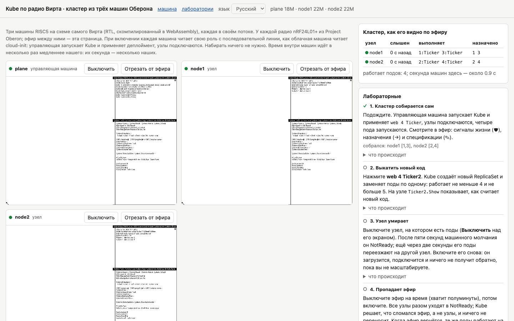

Представьте кластер Kubernetes, в котором нет ни одной сетевой карты. Узлы не знают, что такое TCP, IP и даже Ethernet, они просто перекрикиваются по радио пакетами по 32 байта, как рации на стройке. Управляющий слой вместе с сетевым протоколом написан на языке 1986 года и занимает чуть больше тысячи строк. Под запускается за миллисекунды, потому что никакого образа скачивать не нужно. И всё это можно открыть во вкладке браузера, выдернуть узел из розетки, заглушить эфир, подсунуть кластеру поддельную команду и посмотреть, что будет.

Такой кластер у меня получился за последние несколько недель, и называется он Kube. Это управляющий слой Kubernetes, написанный на Обероне, языке Никлауса Вирта, и работающий на машинах Оберона, процессоре и операционной системе, которые Вирт спроектировал сам, от схемы до окон на экране. Узлы Kube тоже машины Оберона, и разговаривают они через радиосеть, которую Вирт придумал для своих студенческих рабочих станций и описал в той же книге, что и всё остальное.

<cut />

Сразу скажу, зачем мне всё это, потому что вопрос «зачем» в таких историях обычно звучит первым и обычно с усмешкой. Для меня это не шуточный проект и не попытка вытащить на свет красивую старую технологию, чтобы на неё посмотрели и разошлись. В первую очередь это исследование. Мне хочется понять, какой могла бы быть инфраструктура прошлого, если бы идеи, которые сегодня называются Kubernetes, появились тогда, когда компьютеры были маленькими, понятными одному человеку и связанными чем попало. Какие интересные принципы давали забытые технологии, которые мы потом выбросили вместе с ними. Чего этим технологиям не хватало и почему от них отказались. И, если честно разобрать и то и другое, можно попробовать заглянуть в завтрашний день и понять, какой могла бы быть инфраструктура завтрашнего дня, где сложность не обязательно растёт быстрее пользы.

Kubernetes здесь удобная точка опоры. Его основную идею можно уложить в одну фразу: вы не говорите системе, что делать, а записываете, что должно существовать, и набор независимых циклов постоянно сравнивает желаемое с действительным и по шагу сокращает разницу. Эта идея ничего не знает про Go, контейнеры, etcd и облака, её можно переложить на любую машину. А машина Вирта для этого подходит лучше всего, потому что её можно прочитать целиком, от регистров процессора до планировщика подов, и ничего не останется спрятанным под фреймворком. Когда переносишь большую систему в такую маленькую, сразу видно, что в ней суть, а что наслоения, и какие решения были вынужденными, а какие просто привычными.

Это вторая часть моей серии про палеокомпьютинг. В [первой части](https://habr.com/ru/articles/1087928/) я рассказывал, как запустил процессор Вирта в браузере, в QEMU, в Kubernetes и в Cozystack, где машину Оберона теперь можно поставить кнопкой из каталога. Читать её не обязательно: всё, что относится к Оберону и машине Вирта, я буду объяснять по ходу, а Kubernetes, думаю, вы и так знаете лучше меня. Статья опять получилась длинной. Сначала будет рассказ о том, как Kube устроен и как работает, потом о принципах, которые навязали ему язык и операционная система Оберон, и о том, чем он отличается от настоящего Kubernetes, в чём он оказался лучше, а в чём заметно хуже. Потом будут шесть лабораторных, которые можно пройти прямо в браузере, инструкции, как поставить всё это себе, и в конце мои выводы о том, чему такие эксперименты могут научить тех, кто строит инфраструктуру сегодня.

Если хочется сначала потрогать, а потом читать, откройте [лабораторию с кластером](https://tym83.github.io/paleocomputing/oberon/kube.html?lang=ru). Ставить ничего не нужно. Через полминуты три машины загрузятся, управляющая запустит Kube, узлы подключатся, и справа появится таблица кластера, которую страница собирает, просто слушая эфир. Исходники, документация и все замеры лежат в репозитории [github.com/tym83/paleocomputing](https://github.com/tym83/paleocomputing).

