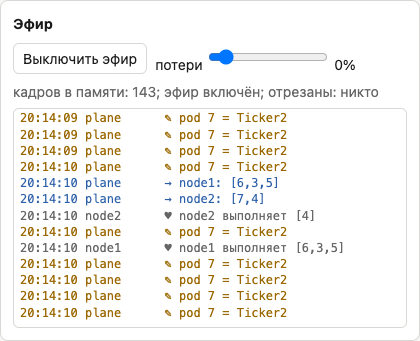
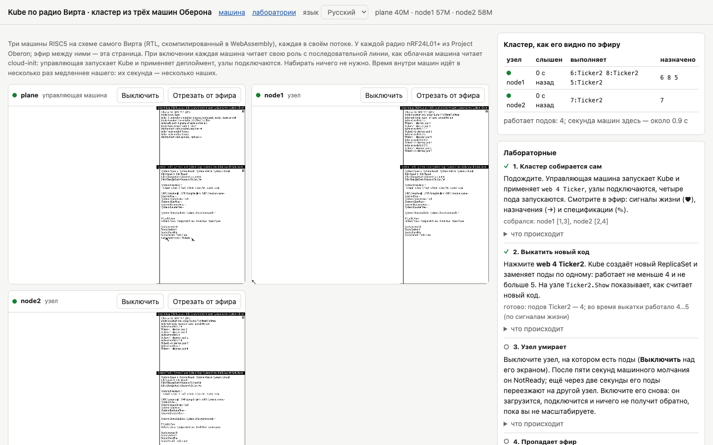

# Как устроен Kube

## С чего всё началось

Первая версия Kube была совсем игрушечной, и я честно рассказывал о ней в отдельном выпуске серии. Это был один модуль на Обероне, в котором жили хранилище объектов и три контроллера, деплойментов, ReplicaSet и узлов. Узлы были просто тремя именами, `node-a`, `node-b` и `node-c`, а под считался работающим потому, что контроллер вписал в него имя узла. Ничего нигде не выполнялось. Зато по этой версии было очень хорошо видно, что сердце Kubernetes — это не контейнеры, а циклы согласования, и что эти циклы прекрасно ложатся на Оберон.

Ложатся они вот почему. В Обероне уже есть ровно то, что нужно управляющему слою, а именно центральный цикл, который вызывает фоновую работу. `Kube.Start` ставит три контроллера в виде трёх задач `Oberon.Task` с периодом 50 миллисекунд, в то же кольцо, где крутится системный сборщик мусора. Дальше `Oberon.Loop` вызывает их всякий раз, когда человек не печатает и не двигает мышь. Контроллеры друг друга не вызывают и ничего друг другу не посылают. Каждый смотрит только на объекты своего вида и меняет только то, чем владеет, а результат его прохода становится входом для другого контроллера на следующем проходе. Ровно так же контроллеры кооперируются в настоящем Kubernetes, через общее состояние, а не через сообщения.

Чтобы назвать это кластером, не хватало двух вещей. Узлов, то есть нескольких машин и способа им переговариваться. И выкаток, то есть замены одной версии приложения другой без провала. Про узлы я сначала думал, что это тупик, потому что сети у машины Вирта нет. А потом перечитал книгу и нашёл там радио.

## Три сообщения, и каждое в один кадр

Протокол, который я назвал KubeNet, состоит из трёх сообщений. Все они рассылаются всем сразу, адресатов в радио всё равно не выбрать, и каждое помещается в один кадр.

Сигнал жизни посылает узел раз в секунду. В нём имя узла и номера подов, которые на нём сейчас действительно работают. Назначение посылает управляющий слой раз в секунду каждому живому узлу, и в нём номера подов, которые за этим узлом закреплены. А спецификация, тоже от управляющего слоя, говорит, какой образ у пода с таким-то номером. Спецификаций управляющий слой посылает по одной за такт, начиная с тех подов, которые ещё не запущены.

Почему один кадр, а не нормальное сообщение любой длины? `SCC` умеет передавать пакеты до полукилобайта, разрезая их на кадры. Но защиты от столкновений в эфире нет, и если две станции одновременно начнут передавать длинные пакеты, их кадры перемешаются у каждого приёмника, а понять, какой кадр чей, приёмник не сможет. Можно было бы придумать захват эфира, очереди, повторные передачи, но это был бы ровно тот путь, по которому сети пришли к сложности, от которой я хотел уйти. Поэтому каждое сообщение умещается в 24 байта данных.

Вот как они расходуются в сигнале жизни и назначении. Байт метки кластера, шесть байт имени узла, байт количества подов, до десяти байт номеров подов, два байта счётчика и четыре байта подписи. Ровно 24. Отсюда и все странные ограничения Kube: имя узла не длиннее шести символов, номер пода — один байт, а на одном узле работает не больше десяти подов, потому что больше в сигнал жизни не помещается и планировщик больше не назначит.

Самое важное свойство протокола — реакция на уровень. Узел выполняет ровно то, что сказано в последнем назначении, а не набор команд «запусти» и «останови». Если назначение потерялось, через секунду придёт следующее с тем же содержимым, и ничего чинить не нужно. Если потерялся сигнал жизни, управляющий слой подождёт следующего. Никаких подтверждений, повторных передач и порядковых номеров для надёжности, вся надёжность получается из того, что каждое сообщение несёт полное состояние, а не изменение. На эфире, теряющем треть пакетов, такой протокол работает без единого ложного срабатывания, и это я измерял.

## Под — это модуль

В настоящем Kubernetes образ пода — это архив файловой системы с программой внутри, который kubelet скачивает из реестра и запускает в изолированном контейнере. В Обероне ничего этого нет, но есть кое-что, что работает похоже и гораздо быстрее. Образ пода в Kube — это имя модуля Оберона на узле.

Когда kubelet узнаёт о новом поде, он вызывает `Modules.Load` с именем образа. Если модуль ещё не загружен, система найдёт на диске его скомпилированный файл, загрузит в память, свяжет со всеми модулями, которые он импортирует, проверит ключи их интерфейсов и выполнит его тело. Потом kubelet находит в модуле команду `Start` и вызывает её. Когда под должен исчезнуть, kubelet вызывает команду `Stop` того же модуля.

Команды Оберона не принимают параметров, поэтому передать поду его номер напрямую нельзя. Для этого есть крошечный модуль `Pods` с двумя переменными, номером и образом. kubelet записывает их перед вызовом, а модуль нагрузки их читает. Решение некрасивое, но очень обероновское: глобальная переменная модуля здесь законный способ передать контекст, потому что в каждый момент выполняется ровно одна команда и гонок быть не может.

`Ticker` и `Ticker2`, две версии учебной нагрузки, при старте пода заводят для него счётчик секунд, а команда `Ticker.Show` печатает, какие поды работают на этой машине и сколько секунд каждый уже прожил. На них очень удобно смотреть выкатку: на узле в журнале видно, как поды первой версии останавливаются, а второй запускаются.

Если модуля с таким именем на узле нет, `Start` вызвать не удастся, и kubelet просто не включит этот под в свой сигнал жизни. Управляющий слой будет видеть, что под назначен, но не работает, и он останется в состоянии Pending. В Kubernetes так выглядит под, образ которого не удалось скачать.

## Хранилище на диске

В Kubernetes всё состояние кластера живёт в etcd, и если управляющий слой перезапустится, он прочитает его оттуда. В Kube роль etcd играет массив из 256 записей в памяти управляющей машины, а чтобы он переживал перезапуск, фоновая задача записывает его на диск всякий раз, когда он меняется.

Пишется он в два файла по очереди, `Kube.Store0` и `Kube.Store1`, и в каждом есть номер поколения и контрольная сумма. Если питание пропадёт посреди записи, испорченным окажется только один файл, а второй, предыдущего поколения, останется целым. При старте `Kube.Start` читает оба и берёт более новый из целых. Файлы переписываются на месте, а не создаются заново, и это тоже требование Оберона: его файловая система освобождает место от заменённых файлов только при следующей загрузке, и если на каждое изменение создавать новый файл, при активной работе кластера диск просто кончится.

После перезапуска управляющий слой даёт всем узлам один таймаут сигнала жизни, чтобы они успели отозваться, прежде чем он начнёт считать их NotReady. Kubernetes делает то же самое после перезапуска своего контроллера узлов. Отсчёт этого таймаута, кстати, пришлось перенести с момента чтения хранилища на момент, когда управляющий слой начинает слушать эфир. В облаке между этими двумя командами человек успевал что-нибудь напечатать через VNC, таймаут истекал, и все поды переезжали, хотя ни один не останавливался.

## Выкатки и две ошибки, которые знакомы Kubernetes

Команда `Kube.Apply web 6 Ticker2` на работающем `web 6 Ticker` меняет образ. Контроллер деплойментов создаёт новый ReplicaSet и начинает переносить поды по одному. Сначала добавляется один под с новым образом. Когда его kubelet сообщил, что под работает, подов становится на один больше желаемого, и старый ReplicaSet убирает один свой под. Так повторяется, пока старый ReplicaSet не опустеет, а потом он удаляется.

Выглядит просто, но по дороге вылезли две ошибки, и обе оказались давно известными Kubernetes.

Первая про остановку пода. Когда управляющий слой удаляет под из хранилища, на узле этот под ещё работает, пока kubelet не услышит следующее назначение, то есть ещё до секунды. Контроллер же в это время уже видит, что подов на один меньше, и добавляет новый. В итоге на мгновение работало восемь подов там, где разрешено было семь. Настоящий Kubernetes ведёт себя точно так же, и только в новых версиях у деплоймента появилось поле, которое заставляет ждать полной остановки старых подов. В Kube я сделал это поведением по умолчанию: поды, о которых узлы ещё сообщают, но которых нет в хранилище, считаются останавливающимися, и пока такие есть, новый под не добавляется.

Вторая про номера подов. Узел знает о поде только его однобайтовый номер. Сначала новый под получал наименьший свободный номер, а это часто оказывался номер того самого старого пода, который только что заменили. kubelet видел в назначении знакомый номер и считал, что ничего не изменилось. Хранилище говорило, что работает Ticker2, а на узле продолжал работать Ticker. Kubernetes никогда не использует UID пода повторно ровно по этой причине. Теперь номера в Kube идут по кругу, и проверка после каждой выкатки требует, чтобы ни один номер старых подов больше не работал.

## Отказы, ради которых строят кластеры

Кластер нужен затем, чтобы переживать отказы, и проверять это я решил так, как проверял бы настоящий. Отдельный тест запускает управляющую машину и два узла и судит о них только по эфиру. Для этого к ретранслятору подключается пассивный слушатель, который ничего не передаёт, а только записывает каждый сигнал жизни и каждое назначение и проверяет их подписи. Тест ничего не спрашивает у самого Kube, он смотрит только на то, что действительно происходило в эфире.

Когда узел выключают, через пять секунд молчания управляющий слой помечает его как NotReady, а ещё через две секунды переносит его поды на другой узел. Всего около восьми секунд. Когда выключают управляющую машину, узлы продолжают выполнять последнее назначение, им некому сказать что-то другое. Когда она загружается снова, хранилище возвращается с диска, и не меняется ни одно назначение. Если модуля на узлах нет, поды остаются Pending. Если минуту теряется 30 процентов пакетов, ни один узел не становится NotReady и ни один под не переезжает.

Таймаут сначала был три секунды. На эфире с потерей в 30 процентов три сигнала жизни подряд пропадали несколько раз в минуту, управляющий слой считал узел мёртвым и переносил поды, которые на самом деле никуда не девались. С пятью секундами ложных срабатываний не стало, а платой стало более медленное восстановление после настоящей аварии, семь секунд вместо четырёх. В Kubernetes та же самая сделка, только в другом масштабе: kubelet отчитывается раз в десять секунд, а управляющий слой ждёт сорок-пятьдесят.

Самым поучительным оказался обрыв эфира. Когда ретранслятор выключается на двадцать секунд, молчат сразу все узлы. Управляющий слой, который просто верит своим таймаутам, решает, что все узлы умерли, и пытается перенести все поды, а переносить их некуда. Когда эфир возвращается, узлы просыпаются по одному, и первый вернувшийся получает поды всех остальных, потом второй забирает часть обратно, и так далее. В первой попытке за двадцать секунд обрыва изменилось 74 назначения. Узлы всё это время работали и ничего не заметили, а кластер устроил сам себе катастрофу.

Kubernetes знает эту ловушку и называет её полностью нарушенной зоной. Если NotReady становятся все узлы, он перестаёт выселять поды, рассуждая так, что одновременная смерть всех узлов гораздо менее вероятна, чем обрыв связи. Kube делает то же самое, если NotReady становятся все узлы или хотя бы 55 процентов из трёх и более. Но заработало это не сразу, понадобились две детали, которые показала только проваленная проверка.

Узлы становятся NotReady не одновременно, их сигналы жизни разнесены во времени до секунды. Поэтому первый замолчавший узел успевал потерять свои поды раньше, чем замолкали остальные и становилось видно, что это обрыв. Теперь поды узла переезжают, только когда он пробыл NotReady две секунды, а за это время замолкают и остальные. Kubernetes по умолчанию ждёт для этого пять минут. А возвращаются узлы тоже по одному, и первый же вернувшийся заканчивал нарушение, когда остальные ещё не успели отозваться, и их поды тут же переезжали. Теперь молчащие узлы получают ещё один таймаут на ответ после конца нарушения, как это делает и Kubernetes, сбрасывая таймеры узлов, когда зона выходит из полного нарушения. С этими двумя деталями за двадцать секунд обрыва не меняется ни одно назначение.

## Чужие в эфире

Однажды в песочнице на одном эфире оказались сразу два кластера, и у обоих был узел с одинаковым именем. Узел одного кластера то запускал свои поды, то останавливал: он слушался назначений обоих управляющих слоёв по очереди. Тогда в начало каждого сообщения добавился байт метки кластера, вычисленный из его имени, и узел стал игнорировать сообщения с чужой меткой.

Но метка ничего не доказывает, её может послать кто угодно. Поэтому дальше появилась подпись ключом кластера и счётчик против повторов, о которых я рассказывал в словаре. Тест на отказы проверяет и это. Сразу после настоящего назначения узлу он посылает от имени постороннего «ничего не запускай» тремя способами: с меткой чужого кластера, без подписи и как записанное ранее настоящее назначение. Узел игнорирует все три. А то же самое сообщение, честно подписанное ключом и с новым счётчиком, узел выполняет, и это контрольный случай, без которого проверка ничего бы не доказывала.

## Сколько это выдерживает

Отдельная нагрузочная проверка запускает управляющую машину и от двух до восьми узлов, по три пода на каждый узел, и меряет по эфиру, как быстро кластер сходится и как быстро восстанавливается после потери узла. При любом размере кластер сходится примерно за три секунды, а после потери узла восстанавливается примерно за шесть, это таймаут в пять секунд плюс секунда до следующего назначения. Ложных NotReady нет ни разу. Эфир на восьми узлах несёт около пятнадцати кадров в секунду, а пропускная способность nRF24L01+ на скорости, которую выставил Вирт, позволяет больше чем в сто раз больше, так что упирается этот кластер не в радио, а в то, что каждая машина Оберона занимает целое ядро хост-машины: цикл Оберона никогда не простаивает.

## Две ошибки в нашем QEMU

Чтобы всё это заработало, пришлось починить две ошибки не в Kube, а в нашей модели машины в QEMU, и обе я бы без кластера не нашёл. Операция `MOD` после умножения иногда возвращала не ту половину произведения, и из-за этого контрольная сумма хранилища никогда не сходилась, а значит, хранилище никогда не записывалось. А машина, у которой однажды пропал ретранслятор, переставала слышать эфир навсегда, потому что UDP-канал QEMU после неудачного чтения тихо отключал своего читателя. Обе находки описаны в репозитории, и это хороший пример того, почему мне так нравится гонять на эмуляторе настоящие программы: загрузка системы ни одну из этих ошибок не трогала.

## Команды при старте и OberonKube

Последний шаг был про удобство, но без него остальное не имело бы смысла. Кластер, в который нужно по VNC набирать команды на каждой машине, никто не станет запускать второй раз. Мне нужно было, чтобы машина при старте сама знала, кто она, как облачная виртуалка узнаёт свою роль из cloud-init.

QEMU теперь принимает строку команд, которые машина выполнит при старте, и подаёт её на последовательный порт, как будто её набрали на консоли. Маленький модуль `Boot` читает эту строку и выполняет команды по очереди, каждую с её параметрами. Вызывается он в самом конце тела модуля `System`, который загружается при старте системы, а сам `System` пересобран из исходников образа с этой одной добавленной строкой, так что его интерфейс и ключ, который проверяют все остальные модули, не изменились.

И тут кластер преподал ещё один урок. Команды при старте выполняются при каждом старте, а не только при первом. Если среди них стоит `Kube.Apply web 4 Ticker`, то после каждого перезапуска управляющей машины деплоймент возвращается к версии первой загрузки, и выкатка, сделанная с тех пор, тихо откатывается. Нашла это, кстати, браузерная лабораторная, а не тесты в QEMU. Теперь для этого есть `Kube.Ensure`, которая создаёт деплоймент, только если его ещё нет.

В Cozystack всё это сложилось в одно приложение каталога, `OberonKube`. Пользователь пишет, сколько нужно узлов, ключ кластера и список деплойментов, а каталог создаёт эфир, управляющую машину и нужное число узлов, и каждой машине передаёт команды для её роли. Кластер собирается сам. Машины одного эфира к тому же стараются разместиться на разных хостах, чтобы потеря одного хоста стоила как можно меньше узлов.
