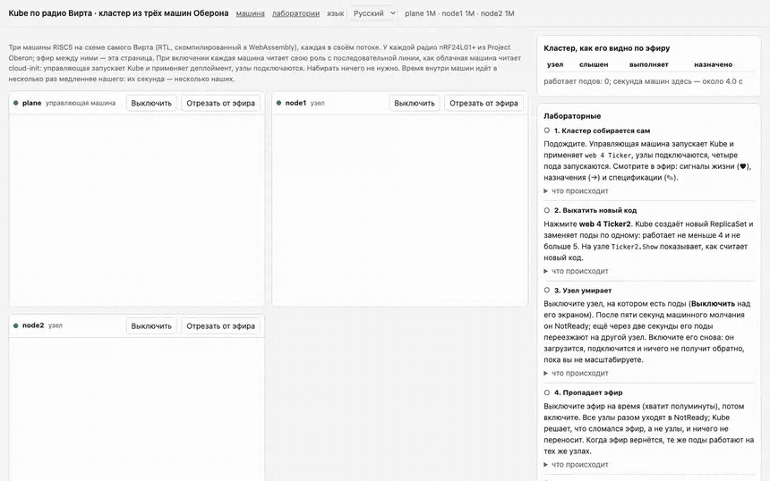
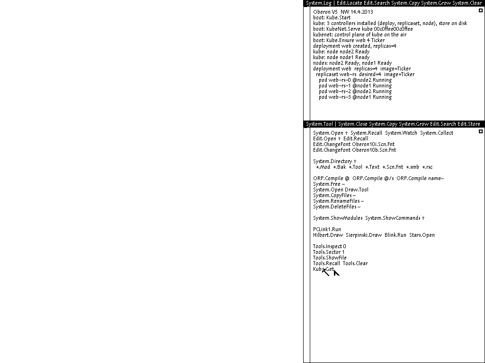
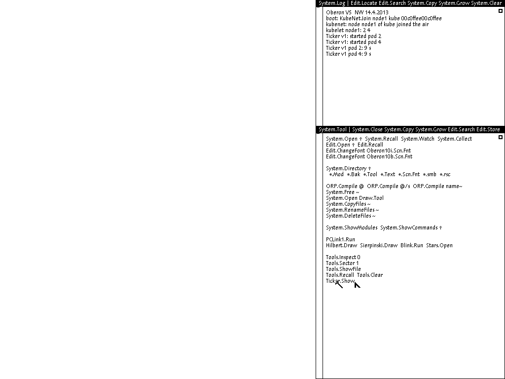
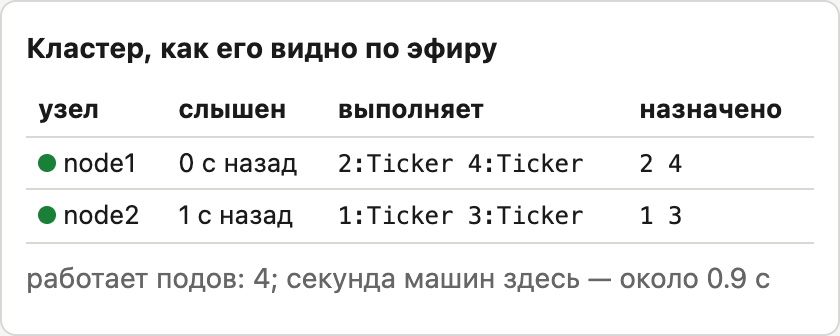
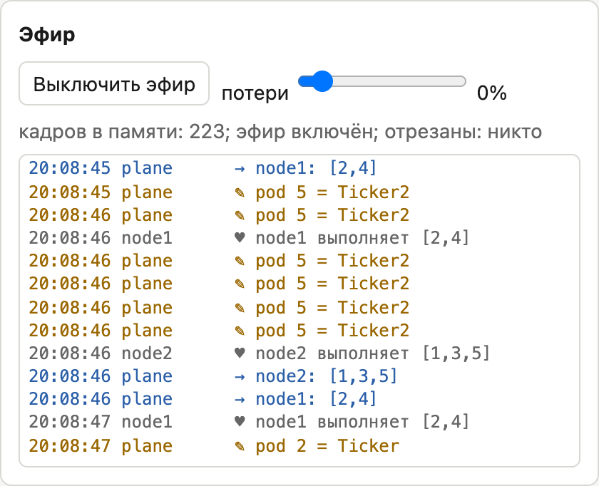
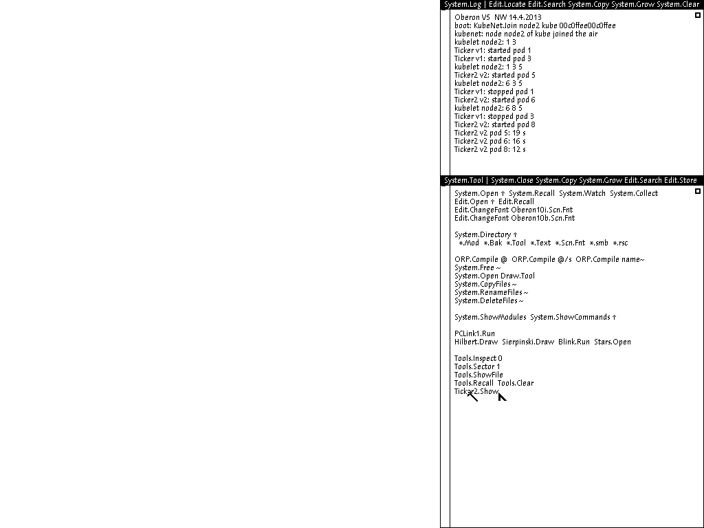
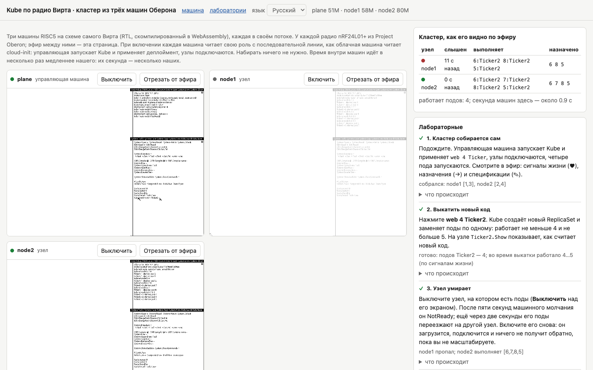
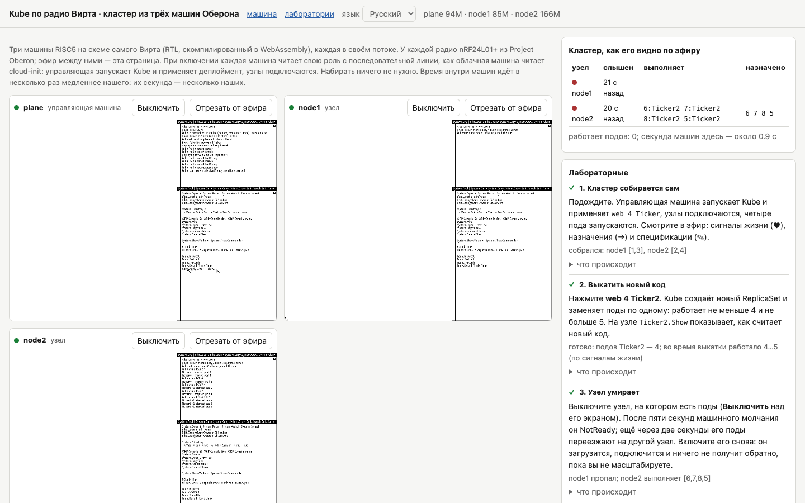
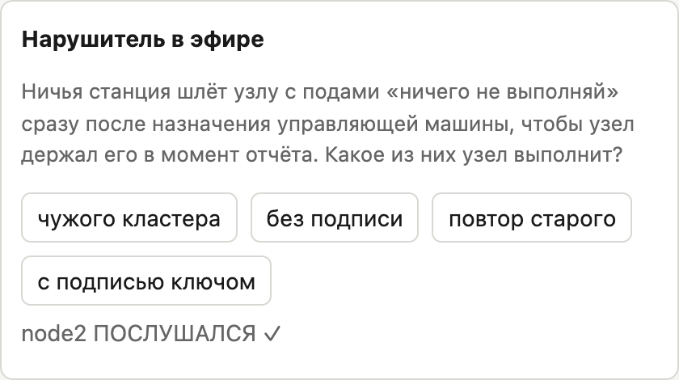
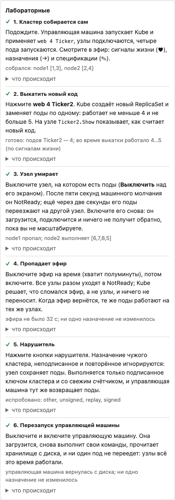

# Шесть лабораторных в браузере

Поначалу я сомневался, что кластер вообще удастся запустить в браузере. Машина Оберона в лабораторках из предыдущей статьи серии уже работала во вкладке: это настоящая схема Вирта, переведённая в C++ и скомпилированная в WebAssembly. Но радио у неё не было, а кластеру нужны три машины, которые слышат друг друга. Пришлось перенести в браузерную машину ту же модель приёмопередатчика nRF24L01+, что уже была в QEMU, и научить её отдавать отправленные кадры наружу и принимать чужие. Каждая машина работает в собственном фоновом потоке, а страница забирает у них кадры и раздаёт остальным, то есть сама служит эфиром. Заодно она умеет терять заданную долю кадров, отрезать от эфира отдельную машину и читать сообщения Kube, сверяя подписи, и поэтому справа на ней видна таблица кластера, составленная по эфиру.

Понадобился и последовательный порт, чтобы машины при включении сами узнавали свои роли, как в облаке. Управляющая машина получает команды `Kube.Start`, `KubeNet.Serve kube 00c0ffee00c0ffee` и `Kube.Ensure web 4 Ticker`, а узлы `KubeNet.Join` со своими именами, так что набирать ничего не нужно. `Kube.Ensure` здесь стоит не случайно, но об этом в шестой лабораторной.

Отдельной задачей оказалась скорость. В WebAssembly схема Вирта выполняет меньше миллиона инструкций в секунду на машину, то есть работает в десятки раз медленнее платы на 25 мегагерц. А Kube отсчитывает время в секундах машины: сигнал жизни раз в секунду, таймаут в пять. Оставь я часы машин честными, кластер собирался бы несколько минут, а лабораторную с выключением узла пришлось бы ждать минут пять. Поэтому страница пускает часы машин вдесятеро быстрее их инструкций, и машины думают, что работают на частоте 2,5 мегагерца. Их секунды текут в темпе, за которым можно уследить глазами, а протоколу всё равно: он не знает, сколько инструкций уложилось в секунду.

Ещё одна неожиданная ловушка подстерегала в фоновых вкладках: браузер сильно замедляет в них таймеры, и кластер почти замирал. Пришлось сделать так, чтобы машины сами крутили свой цикл и не зависели от таймеров страницы. Последней нашлась ловушка с вводом. Страница набирает команду на машине клавишами и щелчками мыши и поначалу делала это за один присест. Это около одиннадцати миллионов инструкций, а при ускоренных часах больше четырёх секунд машинного времени, в течение которых машина не слышит эфира. После каждого нажатия кнопки управляющая машина объявляла оба узла NotReady, и спасало её только то, что при FullDisruption выселение останавливается. Теперь ввод подаётся маленькими порциями вперемежку с работой машины, и эфир доставляется в промежутках.

Каждая лабораторная проверяет себя сама и ставит галочку, когда описанное в ней действительно произошло в эфире. Нажать кнопку и получить галочку не выйдет: проверка смотрит на сигналы жизни и назначения, а не на то, что вы сделали.

[Открыть лабораторку](https://tym83.github.io/paleocomputing/oberon/kube.html?lang=ru)

## 1. Кластер собирается сам

Делать ничего не нужно, достаточно подождать. Машины загружаются, и на экране управляющей видно, как модуль `Boot` выполняет команды, пришедшие по последовательному порту. Kube ставит три контроллера, начинает слушать эфир и создаёт деплоймент `web` на четыре пода, а ещё через пару секунд в журнале появляются строчки «node node1 Ready» и «node node2 Ready».

Тем временем на узлах видно, как kubelet получил назначение и запустил поды модуля Ticker.

Справа на странице заполняется таблица кластера. Для каждого узла в ней видно, когда его слышали в последний раз, какие поды он, по его же словам, выполняет и какие за ним закреплены. Если эти два столбца расходятся, значит, кластер ещё не сошёлся или что-то пошло не так.

## 2. Выкатить новый код

Нажмите кнопку **web 4 Ticker2**. Страница наберёт на управляющей машине команду `Kube.Apply web 4 Ticker2 ~` и выполнит её средним щелчком, как это сделал бы человек. Kube создаст новый ReplicaSet и начнёт переносить поды по одному. Проверка засчитает выкатку, когда все поды заработают на новом образе, и только если за всё это время подов ни разу не стало меньше четырёх или больше пяти. Считает она по сигналам жизни, то есть по тому, что на самом деле выполняли узлы.

Когда выкатка закончится, нажмите на узле **Ticker2.Show**, и он покажет, что считает уже новая версия. Вся история при этом видна в журнале узла: поды Ticker v1 остановлены, поды Ticker v2 запущены, а номера у новых подов не те, что у старых.

## 3. Узел умирает

Нажмите **Выключить** над экраном того узла, на котором работают поды. Экран погаснет, сигналы жизни прекратятся, и через пять секунд машинного времени управляющая машина пометит узел как NotReady, а ещё через две перенесёт его поды на оставшийся. Если включить узел снова, он загрузится, подключится к эфиру и станет Ready, но поды ему никто не вернёт: как и настоящий планировщик, Kube не переносит работающие поды на узел, появившийся позже. Зато новые поды при масштабировании пойдут уже на него как на наименее загруженный.

## 4. Пропадает эфир

Нажмите **Выключить эфир** и подождите полминуты. Все узлы разом уйдут в NotReady, но Kube решит, что сломалась связь, а не узлы, и ничего переносить не станет. Включите эфир обратно, и через пару секунд те же поды окажутся на тех же узлах. Лабораторная засчитывается, только если ни во время обрыва, ни после него не изменилось ни одно назначение.

Самое интересное здесь — раскрыть под лабораторной пояснение «что происходит» и прочитать про 74 переназначения, которые первая версия устраивала за двадцать секунд обрыва. А если хочется, выключите эфир на пару секунд, меньше таймаута, и убедитесь, что не произойдёт вообще ничего.

## 5. Нарушитель

В разделе «Нарушитель в эфире» четыре кнопки. Каждая отправляет от лица постороннего назначение «ничего не запускай» тому узлу, на котором есть поды, причём сразу после настоящего назначения от управляющей машины, чтобы подделка оказалась последним, что узел услышал. Первая кнопка ставит на неё метку чужого кластера, вторая подписывает не тем ключом, третья повторяет записанное ранее подлинное назначение. Все три узел пропускает мимо ушей и продолжает выполнять свои поды.

Четвёртая кнопка подписывает подделку настоящим ключом кластера и ставит свежий счётчик. Это контрольный случай, и узел подчиняется, останавливая поды. Без него лабораторная ничего бы не доказывала: вдруг узел просто не слушает никого, кроме управляющей машины? А через секунду управляющая машина присылает очередное назначение, и поды возвращаются, потому что протокол передаёт полное состояние, а не команды.

Подделки, кстати, видны и в журнале эфира: страница сама проверяет подписи и помечает сообщения с чужой меткой или неверной подписью.

## 6. Перезапуск управляющей машины

Выключите управляющую машину и через несколько секунд включите снова. Она загрузится, ещё раз выполнит свои команды, прочитает хранилище с диска, и ни один под не переедет. Узлы всё это время продолжали работать по последнему назначению, а вернувшаяся управляющая машина дала им один таймаут на ответ, и все успели отозваться.

Именно эта лабораторная нашла последнюю ошибку перед публикацией. Поначалу в командах при старте стояло `Kube.Apply web 4 Ticker`, и после перезапуска деплоймент возвращался к Ticker, перечёркивая выкатку из второй лабораторной. Тесты в QEMU этого не замечали, потому что перезапускали управляющую машину ещё до выкатки. Здесь, где человек выкатывает новую версию вручную, правильно сохранять то, что он сделал, поэтому в командах теперь стоит `Kube.Ensure`: она создаёт деплоймент, только если его ещё нет. В облаке, напротив, источником истины служит форма заказа, и там остался `Kube.Apply`.

## Что ещё можно попробовать

Лабораторными возможности страницы не исчерпываются. Ползунком потерь можно испортить эфир, скажем, терять 30 процентов кадров, и убедиться, что поды при этом никуда не переезжают. Если поднять потери намного выше, рано или поздно пропадут пять сигналов жизни подряд, и Kube примет живой узел за мёртвый; это и есть цена таймаута. Кнопкой **Отрезать от эфира** можно изолировать машину, не выключая её, и посмотреть, как отрезанный узел продолжает выполнять свои поды, хотя управляющая машина уже раздала их другим. Это тот самый случай, когда под работает в двух местах, и Kubernetes живёт с ним точно так же. В поле команды можно написать любую команду Оберона, например `Kube.Apply api 2 Ticker ~`, чтобы создать второй деплоймент, а можно щёлкнуть прямо в экран машины и поработать в ней руками. Средняя кнопка там изображается щелчком с Alt.
