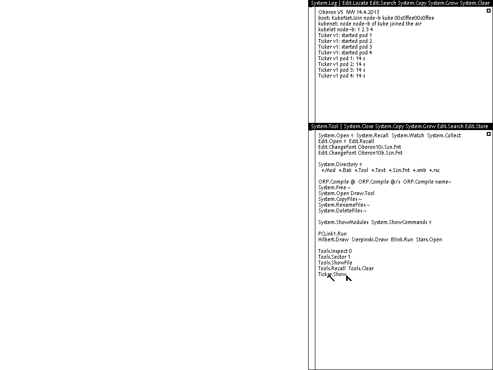

# Как попробовать самому

Способов четыре, и они идут от совсем простого, где ничего не нужно ставить, до своего облака. Всё, что ниже, открыто: исходники лежат в репозитории [tym83/paleocomputing](https://github.com/tym83/paleocomputing), код Kube в папке `impl/kube`, а подробное описание с замерами в `impl/kube/README.md`.

## В браузере

Откройте [лабораторию с кластером](https://tym83.github.io/paleocomputing/oberon/kube.html?lang=ru) и подождите полминуты. Ничего ставить не нужно, всё работает во вкладке, а сервер только отдаёт файлы. Лучше всего страница чувствует себя в свежем Chrome или Firefox на компьютере с несколькими ядрами, потому что каждая из трёх машин занимает своё ядро. Вкладку лучше держать на виду: в фоне браузер замедляет страницу, и кластер, хоть и не останавливается, начинает жить заметно медленнее.

Если хочется запустить ту же страницу у себя, достаточно клонировать репозиторий и поднять любой статический сервер в папке `impl/web`, например `python3 -m http.server 8765`, а потом открыть `http://127.0.0.1:8765/kube.html`. А если браузер не нужен вовсе, тот же кластер из трёх машин запускается в Node.js командой `node impl/web/kube-test.mjs`. Она загружает три машины на настоящей схеме Вирта, ждёт, пока кластер соберётся, и проверяет по эфиру, что все поды работают и все подписи верны.

## В QEMU на своём компьютере

Здесь понадобятся Docker, git и make. Сначала нужно собрать нашу модель машины в QEMU. Сборка идёт в контейнере, поэтому зависимости QEMU ставить в систему не нужно, но займёт она минут десять:

```sh
git clone https://github.com/tym83/paleocomputing
cd paleocomputing
make -C qemu build
```

Готовый диск с системой, на котором уже скомпилированы Kube, KubeNet, нагрузки и модуль команд при старте, проще всего взять из опубликованного образа. Каждой машине нужна своя копия диска, увеличенная до восьми мегабайт, чтобы системе было куда записывать хранилище:

```sh
docker create --name payload ghcr.io/tym83/paleocomputing/oberon-run:v0.1.21
docker cp payload:/opt/oberon/payload/prom.bin .
docker cp payload:/opt/oberon/payload/oberon.dsk .
docker rm payload
for m in plane node1 node2; do cp oberon.dsk $m.dsk; truncate -s 8M $m.dsk; done
```

Дальше нужен эфир. Это отдельная сеть Docker и ретранслятор в ней:

```sh
docker network create kube-air
docker run -d --name relay --network kube-air -v "$PWD/qemu/radio:/r" \
  qemu-build:risc5 'python3 -u /r/relay.py'
```

И три машины, каждая со своими командами при старте. Строка после `commands=` — это ровно то, что машина выполнит после загрузки, команды разделены точкой с запятой:

```sh
run() {
  docker run -d --name $1 --network kube-air -p 127.0.0.1:$2:5900 \
    -v "$PWD/.qemu-work:/src:ro" -v "$PWD:/w" -w /w qemu-build:risc5 \
    "/src/build/qemu-system-risc5 -machine 'oberon,radio=air,commands=$3' \
     -bios prom.bin -drive if=none,id=sd0,file=$1.dsk,format=raw -vnc :0 \
     -chardev udp,id=air,host=relay,port=7524,localaddr=0.0.0.0,localport=7524"
}
KEY=00c0ffee00c0ffee
run plane 5900 "Kube.Start;KubeNet.Serve kube $KEY;Kube.Ensure web 4 Ticker"
run node1 5901 "KubeNet.Join node1 kube $KEY"
run node2 5902 "KubeNet.Join node2 kube $KEY"
```

Экраны машин доступны по VNC на портах 5900, 5901 и 5902. Загрузка в программной эмуляции занимает до минуты, после неё в журнале управляющей машины появятся строчки о готовых узлах, а на узлах — о запущенных подах. Мышь в Обероне трёхкнопочная, средняя кнопка выполняет команду, на которую указывает, так что `Kube.Get` в любом окне управляющей машины покажет все объекты, а `Ticker.Show` на узле — его поды. Выкатить новую версию можно, написав на управляющей машине `Kube.Apply web 4 Ticker2 ~` и щёлкнув по этой строчке средней кнопкой.




Послушать эфир можно со стороны, как это делают тесты. Слушатель подключается к ретранслятору как ещё одна машина, ничего не передаёт и печатает каждое сообщение с проверкой подписи:

```sh
docker run --rm -it --network kube-air -v "$PWD/qemu/radio:/r" \
  qemu-build:risc5 'python3 -u /r/listen.py relay --key 00c0ffee00c0ffee'
```

А дальше можно ломать. `docker stop node2` выключает узел, `docker stop relay` глушит эфир, а `docker start` возвращает и то и другое. В той же папке лежит `inject.py`, который умеет быть нарушителем.

Ровно так же, только автоматически, кластер запускают проверки в репозитории. После сборки QEMU и инструментов (`make -C impl tools`) их можно прогнать самому: `python3 qemu/test/kube_dr_check.py` проверяет все отказы из таблицы выше, `python3 qemu/test/kube_boot_check.py` — сборку кластера из одних команд при старте, а `python3 qemu/test/kube_load_check.py --nodes 4` меряет нагрузку. Учтите, что каждая машина Оберона занимает целое ядро, её цикл никогда не простаивает, так что восемь узлов на ноутбуке будут мерить скорее ноутбук, чем кластер.

Когда наиграетесь, контейнеры удаляются через `docker rm -f plane node1 node2 relay`, а сеть через `docker network rm kube-air`.

## В своём KubeVirt

Машину Оберона можно запустить и в обычном KubeVirt, без Cozystack. Для этого нужен наш образ virt-launcher, который знает архитектуру RISC5, и включённая в KubeVirt возможность подключать к виртуалкам перехватчики. Как это сделать, подробно написано в [инструкции](https://github.com/tym83/paleocomputing/blob/main/kubevirt/GUIDE.ru.md), там же есть пример ресурса VirtualMachine. Для кластера нужны три такие машины, ретранслятор в виде обычного пода с сервисом UDP и команды при старте в аннотации машины, которые перехватчик передаст в QEMU. Это ровно то, что за вас делает каталог Cozystack, так что если Cozystack у вас нет, проще всего подсмотреть, что именно создают его чарты в папке `marketplace`.

## В Cozystack

Если у вас есть Cozystack, достаточно один раз подключить наш каталог утилитой `cozypkg`:

```sh
cozypkg tap oci://ghcr.io/tym83/paleocomputing/machines:v0.1.21
cozypkg add paleocomputing.machines
```

У администратора кластера при этом есть две обязанности: включить в KubeVirt признак Sidecar и поставить наш образ virt-launcher, соответствующий вашей версии KubeVirt. Подробности на [странице проекта](https://tym83.github.io/paleocomputing/ru/cozystack/).

После этого в дашборде у пользователей появится раздел Paleocomputing, а в нём OberonVM, OberonAir и OberonKube. Кластер Kube заказывается одной формой или одним ресурсом:

```yaml
apiVersion: apps.cozystack.io/v1alpha1
kind: OberonKube
metadata:
  name: farm
spec:
  nodes: 3
  key: 00c0ffee00c0ffee
  deployments: web 4 Ticker; api 2 Ticker2
```

Из этого заказа каталог создаст эфир, управляющую машину и три узла, и кластер соберётся сам. Экран любой машины открывается через `virtctl vnc` с правами тенанта, имена машин видны в дашборде. Удаление заказа удаляет и все его части.

Можно собрать кластер и вручную, из отдельных машин. Тогда нужно создать `OberonAir`, а в каждой `OberonVM` указать этот эфир в поле `air`, роль в поле `kubeRole` (`plane` для управляющей машины и `node` для узлов), имя узла в `kubeNode` и одинаковый ключ в `kubeKey`. Так интереснее, если хочется, например, поставить на один эфир два кластера с разными ключами и посмотреть, как они не мешают друг другу.
