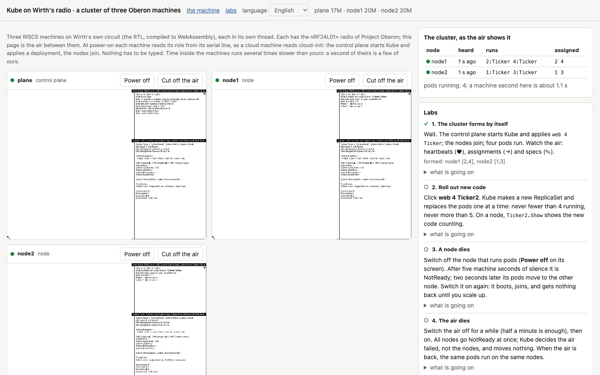

Picture a Kubernetes cluster without a single network card. Its nodes have never heard of TCP, IP or even Ethernet; they shout at each other over the radio in 32-byte packets, like walkie-talkies on a building site. The control plane, network protocol included, is written in a language from 1986 and takes a little over a thousand lines. A pod starts in milliseconds, because there is no image to pull. And the whole thing opens in a browser tab, where you can pull a node's plug, jam the air, slip the cluster a forged command and see what happens.

That cluster is what I have built over the last few weeks, and it is called Kube. It is a Kubernetes control plane written in Oberon, Niklaus Wirth's language, running on Oberon machines: the processor and operating system Wirth designed himself, from the circuit to the windows on the screen. Kube's nodes are Oberon machines too, and they talk over the radio network Wirth devised for his student workstations and described in the same book as everything else.

Let me say right away why I am doing this, because "why" is usually the first question in stories like this one, and it usually comes with a smirk. For me this is not a joke project, and not an attempt to drag a pretty old technology into the light so people can look at it and move on. It is research first of all. I want to understand what the infrastructure of the past could have looked like if the ideas we now call Kubernetes had appeared back when computers were small, understandable by one person, and connected by whatever was at hand. What interesting principles the forgotten technologies offered, which we then threw out together with them. What those technologies lacked, and why they were abandoned. And, having taken both sides apart honestly, to try and look into tomorrow: what the infrastructure of the future could look like, where complexity does not have to grow faster than usefulness.

Kubernetes is a convenient point of reference. Its core idea fits into one sentence: you do not tell the system what to do; you write down what should exist, and a set of independent loops keeps comparing the wanted with the actual and closes the gap one step at a time. That idea knows nothing about Go, containers, etcd or clouds, and it can be carried over to any machine. Wirth's machine suits it best of all, because it can be read in full, from the processor's registers to the pod scheduler, with nothing hidden under a framework. When you move a big system into a very small one, you immediately see what is its essence and what is sediment, and which decisions were forced and which were merely habit.

This continues my series on paleocomputing. In the [previous article](LINK-TO-PREVIOUS-ARTICLE) I told how I ran Wirth's processor in a browser, in QEMU, in Kubernetes and in Cozystack, where an Oberon machine can now be installed with a click from the catalog. You do not need to read it: I will explain everything needed here again and go through every term in detail, even the ones that seem obvious. The article came out long once more. First comes a glossary, then how Kube is built and how it works, then the principles the Oberon language and operating system imposed on it and how it differs from real Kubernetes, where it turned out better and where noticeably worse. After that come six labs you can do right in the browser, instructions for running it all yourself, and finally my conclusions about what such experiments can teach those who build infrastructure today.

If you would rather touch first and read later, open the [cluster lab](https://tym83.github.io/paleocomputing/oberon/kube.html). Nothing needs installing. Within half a minute three machines boot, the control plane starts Kube, the nodes join, and a cluster table appears on the right, which the page builds simply by listening to the air. Sources, documentation and every measurement are in the repository [github.com/tym83/paleocomputing](https://github.com/tym83/paleocomputing).

