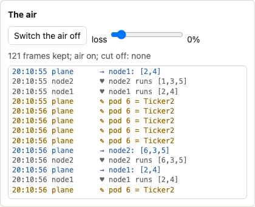
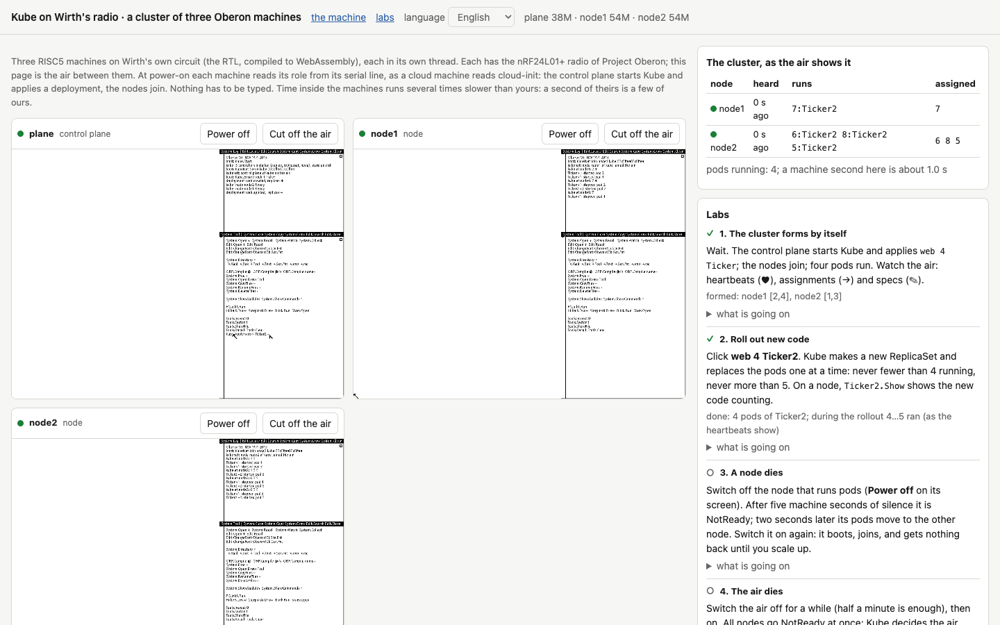
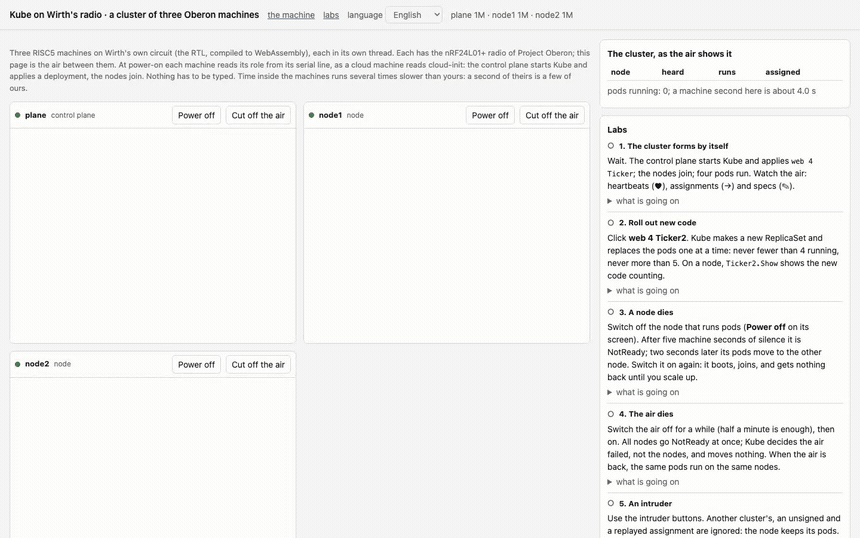
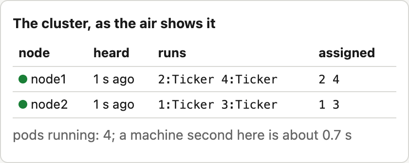
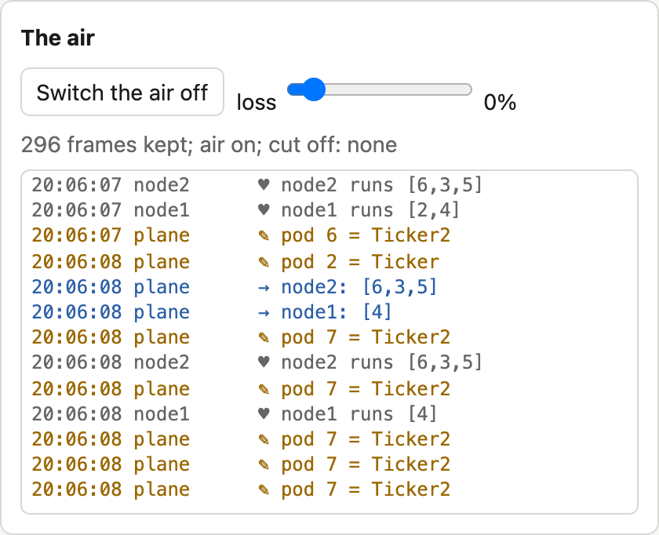
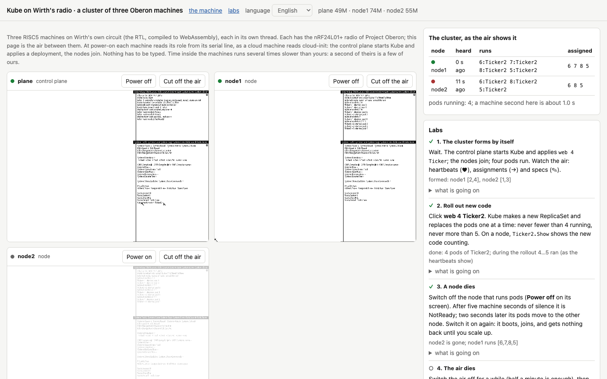
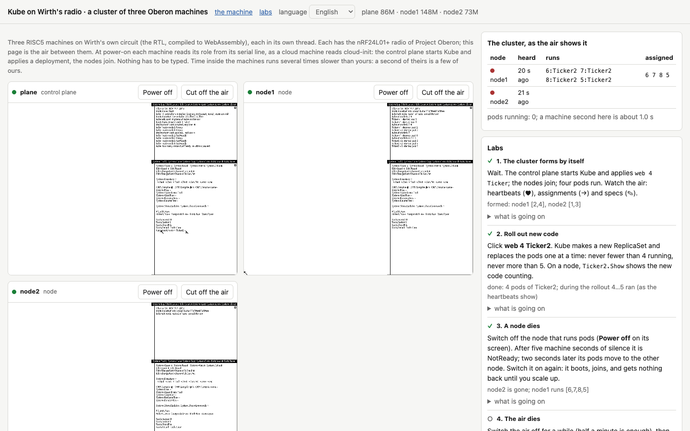
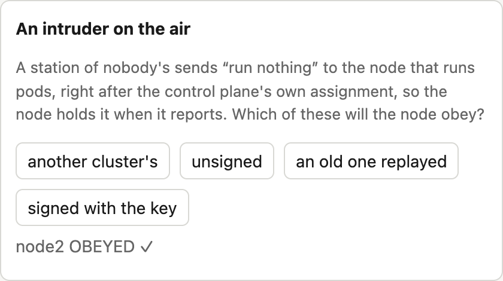
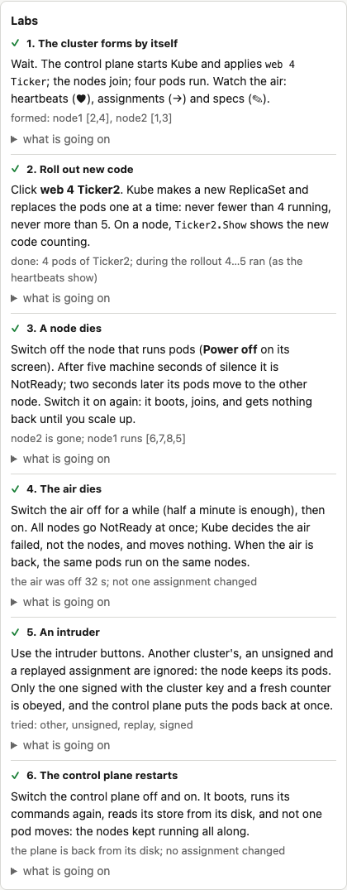

# Paleocomputing, part 2: Kubernetes in Oberon, Wirth's radio instead of a network, a cluster in your browser, and what forgotten technology says about tomorrow's infrastructure

Picture a Kubernetes cluster without a single network card. Its nodes know nothing of TCP/IP, or even of Ethernet; they call to each other over the radio in short 32-byte packets, like foremen on walkie-talkies at a building site. The control plane is written in a language from the late eighties and, network protocol included, takes about 1,250 lines. Starting a pod involves no download: the node simply loads a module and calls a procedure in it. And best of all, the whole thing opens in a browser tab, where you can pull a node's plug, jam the air, slip the cluster a forged command and watch what happens.

I built this cluster over the last few weeks and called it Kube. It is a Kubernetes control plane written in Oberon, Niklaus Wirth's language, and it runs on Oberon machines, that is, on the processor and operating system Wirth designed himself, from the circuit to the windows on the screen. Kube's nodes are Oberon machines too, and they talk over a radio network from the same book: Wirth wrote that network for his workstations back in the late eighties, and the new edition of the project moved it onto a cheap radio module.

Let me say straight away why I am doing this, since in stories like this one that question always comes first, and usually with a smirk. For me this is not a project for laughs, nor an attempt to drag a pretty old technology into the light for people to admire and move on. It is research first and foremost. I want to understand what the infrastructure of the past might have become if the ideas we now call Kubernetes had appeared in the years when a computer was small, wholly understandable by one person, and connected to its neighbours by whatever was at hand. What interesting principles the forgotten technologies carried, and what we threw out along with them. What those technologies lacked, and why they were abandoned. And if you honestly sort out both, you can try to look into tomorrow and imagine an infrastructure where complexity need not grow faster than usefulness.

Kubernetes is a convenient point of reference here. Its main idea fits in one sentence: you do not tell the system what to do, you describe what should exist, and a set of independent loops compares the wanted with the actual over and over and closes the gap step by step. The idea knows nothing about Go, containers, etcd or clouds, and it can be carried over to any machine. Wirth's machine suits it better than any, because it can be read in full, from the processor's registers to the pod scheduler, with nothing hidden under a framework. When you move a big system into such a small one, it immediately becomes clear what in it is essence and what is sediment, and which decisions were forced and which were mere habit.

This is the second part of my series on paleocomputing. In [the first part](https://aenix.io/blog/2026/09/nine-days-of-paleocomputing/) I told how I ran Wirth's processor in a browser, in QEMU, in Kubernetes and in Cozystack, where an Oberon machine can now be installed from the catalog with one click. You do not need to read it: whatever concerns Oberon and Wirth's machine I will explain along the way, and Kubernetes you probably know as well as I do. The article came out long again. First I will tell how Kube is built and how it works, then about the principles the Oberon language and operating system imposed on it, how it differs from real Kubernetes, where it turned out better and where noticeably worse. After that come six labs you can do right in the browser, instructions for those who want to install it all themselves, and at the end my conclusions about what such experiments can teach the people who build infrastructure today.

If you would rather touch first and read later, open the [cluster lab](https://tym83.github.io/paleocomputing/oberon/kube.html). Nothing needs installing. Within half a minute three machines boot, the control plane starts Kube, the nodes join, and a cluster table appears on the right, which the page builds simply by listening to the air. Sources, documentation and every measurement are in the repository [github.com/tym83/paleocomputing](https://github.com/tym83/paleocomputing).


# How Kube is built

## Oberon and Wirth's machine in brief

Oberon is both a programming language and an operating system. They were made in the mid-eighties at ETH Zurich by Niklaus Wirth, the author of Pascal and Modula-2, and Jürg Gutknecht. The language is tiny: modules, records, arrays, pointers, garbage collection and strict typing, while exceptions, generics and even unsigned integers are absent. The system matches the language. It has no processes, no threads and no memory protection. At the very bottom spins a single loop, `Oberon.Loop`: it polls the mouse and keyboard, calls commands one at a time, and in the pauses between input events calls background tasks, `Oberon.Task`. A task cannot be interrupted, so it must do its piece of work quickly and return. Multitasking here, in other words, is cooperative and rests on the good manners of everyone involved.

In 2013 Wirth published a new edition of the book Project Oberon and added his own processor to the system, RISC5, described in Verilog. Loaded into an FPGA, it ran on a board with a megabyte of memory at 25 MHz. That is Wirth's machine. With us it lives in three guises: in the browser runs Wirth's actual circuit, translated to C++ and compiled to WebAssembly; in QEMU runs our own model of the machine; and in Kubernetes the same QEMU model runs inside KubeVirt.

## Where it all started

The first version of Kube was a pure toy, and I said so honestly in a separate episode of the series. It was a single Oberon module holding an object store and three controllers, for deployments, ReplicaSets and nodes. The nodes were three names, `node-a`, `node-b` and `node-c`, and a pod counted as running only because a controller had written a node's name into it. Nothing ran anywhere. But even that version showed very clearly that the heart of Kubernetes is not containers but reconcile loops, and that these loops fit Oberon beautifully.

They fit because Oberon already has everything a control plane needs, namely a central loop that calls background work. `Kube.Start` installs the three controllers as three `Oberon.Task`s with a period of 50 milliseconds, in the same ring where the system's garbage collector spins, and from then on `Oberon.Loop` calls them whenever the user is not typing or moving the mouse. The controllers do not call each other or send each other anything. Each looks only at objects of its own kind and changes only what it owns, and the result of its pass becomes the input of a neighbour on its next pass. That is exactly how the controllers of real Kubernetes interact: through shared state, not through messages.

To call all this a cluster, two things were missing. First, nodes, meaning several machines and a way for them to talk. Second, rollouts, where one version of an application replaces another without downtime. With nodes I thought at first that I had hit a dead end, since Wirth's machine has no network. Then I reread the book and found the radio in it.

## Wirth's radio

The Oberon workstations at ETH were always networked. Wirth wrote that network back in the late eighties for the wired Ceres workstation, and in the 2013 edition Paul Reed, who worked with him on the new version of the project, moved it onto radio. The board carries an nRF24L01+ transceiver, a cheap chip still found today in wireless keyboards and hobby gadgets, and the processor talks to it over SPI, a simple serial bus. The chip is very modest. It sends a frame of at most 32 bytes at a time, received frames wait their turn in a three-slot buffer, all stations on one channel hear each other, and there is no collision avoidance at all: if two stations speak at once, the receiver gets either garbage or nothing.

The chip's driver, the module `SCC`, is about two hundred lines. Each of its packets starts with an eight-byte header holding addresses, a type and a length, and a long packet is cut into several 32-byte frames. On top of `SCC` sits the module `Net`, a small protocol stations use to send each other messages and files. From here on, by Wirth's radio I will mean exactly this pair, and by the air everything the stations on one channel hear.

Why radio rather than an ordinary network? Because Wirth's machine simply has no other. It has neither Ethernet nor a TCP/IP stack, and writing them would mean building a little Linux on Oberon. The radio, on the other hand, is described in the very same book, and I was curious what kind of system would come out if I honestly accepted the machine's limits instead of dragging a modern network onto it.

A virtual machine has no real radio, of course. So our QEMU model emulates the whole nRF24L01+ chip, registers and queues included, and wraps every frame it sends in a UDP datagram. The datagrams flow to a relay, a small program that hands every frame to all the other machines. That is the air. The relay can lose a given share of frames, and if you stop it, the air is gone altogether. In Cozystack, our open platform built on Kubernetes, the relay became a catalog application, `OberonAir`, and in the browser the page itself plays the air.

## Three messages, each in one frame

The protocol, which I called KubeNet, has just three messages. Each goes to everyone at once, since a radio cannot pick a receiver anyway, and each fits into one frame.

A node sends its heartbeat once a second, giving its name and the ids of the pods that are actually running on it right now. The control plane sends an assignment to every live node once a second, listing the pods bound to that node. The third message, a spec, also comes from the control plane and tells which image the pod with a given id has. Specs go out one per tick, pods not yet started first.

Why one frame and not a message of any length? `SCC` can send packets of up to half a kilobyte by cutting them into frames, but the air has no collision avoidance. If two stations start sending long packets at the same time, their frames get interleaved at every receiver, and a receiver can no longer tell whose frame is whose. One could invent air arbitration, queues and retransmissions, but that is exactly the road along which networks arrived at the complexity I wanted to get away from. So every message fits into one frame, which leaves 24 bytes of data after the `SCC` header.

In a heartbeat and an assignment these bytes are laid out as follows: the cluster tag, six bytes of node name, the pod count, up to ten pod ids at a byte each, two bytes of counter and four bytes of signature. Exactly twenty-four. Hence all of Kube's odd limits: a node name is at most six characters, a pod id takes one byte, and a node runs at most ten pods, because no more fit into a heartbeat and the scheduler will not bind more.

The main property of the protocol is that it is level-triggered, like Kubernetes controllers, only not inside the control plane but on the network itself. A node runs exactly what its last assignment says, not a sequence of "start" and "stop" commands. If an assignment is lost, another with the same content comes a second later, so there is nothing to repair. If a heartbeat is lost, the control plane waits for the next one. There are no acknowledgements, no retransmissions and no sequence numbers for reliability: all of the reliability comes from each message carrying the full state rather than a change. Even on an air that loses 30 percent of its packets, not a single pod moved in a minute, and I checked that.



## A pod is a module

In real Kubernetes a pod's image is a file-system archive with a program inside: the kubelet pulls it from a registry and runs it in an isolated container. Oberon has nothing like that, but it has a mechanism that works similarly and much faster. A pod's image in Kube is simply the name of an Oberon module on the node.

On learning of a new pod, the kubelet calls `Modules.Load` with the image name. If the module is not loaded yet, the system finds its compiled file on disk, loads it into memory, links it with every module it imports, checks the keys of their interfaces and runs the module's body. A key is a kind of checksum of the interface that the compiler writes into every module. If an interface has changed, the system refuses to load modules compiled against the old version. Then the kubelet finds the module's `Start` command and calls it, and when the pod is to go away, it calls the same module's `Stop` command.

A command in Oberon is any exported procedure without parameters. You run it by middle-clicking the text `Module.Procedure` in any window, and if it needs parameters, it reads them itself from the text after its name. So a pod's id cannot be passed directly, and that is what a tiny module, `Pods`, with two variables, the id and the image, is for. The kubelet fills them in before the call, and the workload module reads them. Not the most elegant solution, but very much in Oberon's spirit: a module's global variable is a legitimate way to pass context here, because only one command runs at any moment and races have nowhere to come from.

The teaching workload comes in two versions, `Ticker` and `Ticker2`. For each pod it starts it keeps a seconds counter, and the command `Ticker.Show` prints which pods run on this machine and how many seconds each has lived. They make rollouts easy to watch: the node's log shows the first version's pods stopping and the second version's starting.

If there is no module of that name on the node, `Start` cannot be called, and the kubelet simply leaves the pod out of its heartbeat. The control plane sees that the pod is assigned but not running, and it stays Pending. In Kubernetes, that is what a pod whose image could not be pulled looks like.

## The store on disk

In Kubernetes the whole state of the cluster lives in etcd, and a restarted control plane reads it from there. In Kube the role of etcd is played by an array of 256 records in the control plane machine's memory, and so that it survives a restart, a background task writes it to disk whenever it changes.

It is written to two files in turn, `Kube.Store0` and `Kube.Store1`, each holding a generation number and a checksum. If power fails in the middle of a write, only one file is damaged, and the other, of the previous generation, survives. At start `Kube.Start` reads both and takes the newer of the whole ones. The files are rewritten in place rather than created anew, and Oberon demands this too: its file system frees the space of replaced files only at the next boot, and if a new file were created for every change, a busy cluster would simply run the disk out.

After a restart the control plane gives the nodes one heartbeat timeout to report, and only then begins to count them NotReady. Kubernetes does the same after its node controller restarts. The start of that timeout, by the way, had to move from the moment the store has been read to the moment the control plane starts listening to the air. In the cloud, a person managed to type something over VNC between those two commands, the timeout ran out, and every pod moved, although none had stopped.

## Rollouts, and two bugs Kubernetes knows well

The command `Kube.Apply web 6 Ticker2`, given to a running `web 6 Ticker`, changes the image. The deployment controller creates a new ReplicaSet and starts moving pods one at a time. First a pod with the new image is added. As soon as its kubelet reports it running, there is one pod more than wanted, and the old ReplicaSet removes one of its own. This repeats until the old ReplicaSet is empty, and then it is deleted.

It looks simple, but two bugs surfaced along the way, and both turned out to be old acquaintances of Kubernetes.

The first concerns stopping a pod. When the control plane deletes a pod from the store, the pod keeps running on its node until the kubelet hears the next assignment, which can take up to a second. By then the controller already sees one pod fewer and adds a new one. As a result, for a moment eight pods ran where seven were allowed. Real Kubernetes behaves in exactly the same way, and only recently has the Deployment gained the field `podReplacementPolicy`, which makes it wait until old pods have stopped completely, and even that is still alpha, behind a feature gate. In Kube I made this the only behaviour: pods the nodes still report but the store no longer holds count as stopping, and while there are any, no new pod is added.

The second bug concerns pod ids. A node knows a pod only by its one-byte id. At first a new pod got the lowest free id, and that often turned out to be the id of the very old pod it had just replaced. The kubelet saw a familiar id in the assignment and decided nothing had changed. The store claimed Ticker2 was running, while Ticker kept spinning on the node. This is exactly why Kubernetes never reuses a pod's UID. Kube's ids now go round, and the check after every rollout requires that no id of an old pod is running any more.



## The failures clusters are built for

A cluster exists to survive failures, and I decided to test that the way I would test a real one. A separate test starts a control plane and two nodes and judges them solely by the air. For that a passive listener joins the relay: it sends nothing, only records every heartbeat and every assignment and checks their signatures. The test asks Kube itself almost nothing: only the outcome of a rollout is compared with what Kube wrote to disk, and everything else is judged by what actually happened on the air.

Switch a node off, and after five seconds of silence the control plane marks it NotReady, and two seconds later moves its pods to another node, so that the whole thing takes about eight seconds. Switch the control plane off, and the nodes keep running their last assignment, because there is nobody to tell them otherwise. When it boots again, the store comes back from disk and not one assignment changes. If the nodes lack the module, the pods stay Pending. And if 30 percent of packets are lost for a whole minute, not one pod moves.

At first the timeout was three seconds. On an air losing 30 percent, three heartbeats in a row went missing several times a minute, and the control plane, taking the node for dead, moved pods that had never gone anywhere. With five seconds, false alarms became dozens of times rarer, and the price was slower recovery from a real failure. Kubernetes makes the same bargain at another scale: the kubelet reports every ten seconds, and the control plane waits forty to fifty.

The most instructive case was losing the air. When the relay falls silent for twenty seconds, all the nodes fall silent at once. A control plane that simply trusts its timeouts decides the nodes have died and tries to move every pod, although there is nowhere to move them. And when the air comes back, the nodes come to life one by one: the first one back receives everyone else's pods, the second takes some of them back, and so on. In the first version twenty seconds of outage changed 74 assignments. The nodes kept working the whole time and noticed nothing, while the cluster staged a disaster for itself.

Kubernetes knows this trap: when all nodes of a zone go NotReady at once, the node controller puts the zone into the FullDisruption state and stops evicting pods, reasoning that all nodes dying at the same moment is far less likely than a lost link. Kube does the same when all nodes, or at least 55 percent of three or more, go NotReady. But it did not work at once: it took two details that only came to light in a failed check.

First, nodes do not go NotReady at the same moment; their heartbeats are up to a second apart. So the first node to go silent lost its pods before the others went silent and it became clear that this was an outage. Now a node's pods move only after it has been NotReady for two seconds, and by then all the others have gone silent too. Kubernetes waits five minutes for this by default. Second, nodes also come back one by one, and the very first to return took the cluster out of that state before the others had reported, so their pods moved at once. Now the silent nodes get one more timeout to report after leaving it, as Kubernetes does too, resetting the nodes' timers when a zone leaves FullDisruption. With these two corrections, twenty seconds of outage change not a single assignment.

## Strangers on the air

Once, in the sandbox, two clusters ended up on one air, and both had a node of the same name. A node of one cluster kept starting and stopping its pods, because it obeyed the assignments of both control planes in turn. So a cluster tag was added to the start of every message, a byte computed from the cluster's name, and a node began to ignore messages with a foreign tag.

But a tag proves nothing; anyone can send it, so a signature came next. Every message carries an authentication code, a MAC, computed from the message itself and the cluster's secret key, and without the key the right code cannot be guessed. It is computed with HalfSipHash-2-4, a reduced variant of SipHash that works on 32-bit words and gives a 32-bit result. HMAC-SHA256 will not do here: Wirth's processor is 32-bit and runs at 25 MHz, and of the message's 24 bytes the signature can take four at most. HalfSipHash was made precisely for such small devices, and in Oberon it takes about thirty lines. Thirty-two bits is on the small side for serious cryptography, but for a teaching cluster it is an honest compromise.

A signature does not prevent a recorded genuine message from being replayed, so every message also carries a 16-bit counter, and the receiver drops anything not newer than the last one accepted from the same sender. The failure test checks this too. Right after a genuine assignment it sends the node, on behalf of a stranger, "run nothing" in three ways: tagged as another cluster's, signed with the wrong key, and as a genuine assignment recorded earlier. The node ignores all three. The same message, honestly signed with the key and with a fresh counter, it obeys, and that is the control case without which the check would prove nothing.

## How much it takes

A separate load test starts a control plane and two to eight nodes, three pods per node, and measures from the air how fast the cluster converges and how fast it recovers from losing a node. At any size it converges in about three seconds, and losing a node costs about eight: five seconds of timeout, two seconds of pause before eviction, and up to a second until the next assignment. There was never a false NotReady.

The cluster does have a ceiling, and it lies not in the radio itself but in Wirth's driver. Before every send, `SCC` waits 50 milliseconds to let someone else's acknowledgement finish, and the machine does nothing else meanwhile. So one station can send at most twenty messages a second. The control plane needs one assignment per node every second, so with eight nodes it spends almost half its time waiting, while received frames pile up in the three-slot buffer and the extra ones are lost. During a rollout specs join the assignments, one per tick, and the waiting takes up almost all the time. By my reckoning the protocol can carry about twenty nodes when idle and about ten during a rollout. That is a calculation from the code, not a measurement. Besides, every Oberon machine occupies a whole host core, since its loop never idles, and eight nodes on one machine load that machine rather than the air.

## Two bugs in our QEMU

To make all of this work, two bugs had to be fixed not in Kube but in our machine model for QEMU, and without the cluster I would have found neither. The `MOD` operation after a multiplication sometimes returned the wrong half of the product, so the store's checksum always came out as zero. The background task saw no changes in it, and the store was never written once. And a machine that had once lost its relay stopped hearing the air for good, because QEMU's UDP channel quietly dropped its reader after a failed read. Both findings are described in the repository, and they are a good example of why I so like running real programs on an emulator: booting the system triggered neither bug.

## Commands at start, and OberonKube

The last step was about convenience, but without it everything else would have lost its point. Nobody will start a cluster a second time if commands have to be typed over VNC on every machine. I needed each machine to know who it is at start, the way a cloud VM learns its role from cloud-init.

QEMU now takes a string of commands for the machine to run at start and feeds it to the serial port, as if it had been typed at a console. A small module, `Boot`, reads the string and runs the commands one after another, each with its parameters. It is called at the very end of the body of `System`, the module loaded when the system starts. `System` itself is rebuilt from the image's own sources with that single line added, so its interface, and the key every other module checks, stayed the same.

Here the cluster taught one more lesson. The commands at start run at every boot, not just the first. If `Kube.Apply web 4 Ticker` is among them, then after a restart of the control plane the deployment returns to what the commands say, and a rollout done by hand since then is quietly undone. Whether that is good or bad depends on what you take as the source of truth. In the cloud it is the order form, and returning to it is exactly the right behaviour there. But in the browser lab, where a person rolls out a new version by hand, it was a bug, and it was the lab itself, by the way, not the QEMU tests, that found it. For such cases there is now the command `Kube.Ensure`, which creates a deployment only if there is none yet.

In Cozystack all of this came together in one catalog application, `OberonKube`. A user says how many nodes they need, the cluster key and a list of deployments, and the catalog creates the air, the control plane machine and the nodes, and gives each machine the commands for its role. The cluster forms by itself. The form here is the source of truth: a changed list of deployments takes effect at the next restart of the control plane. The machines of one air also try to land on different hosts, so that losing a host costs as few nodes as possible.

# What Oberon imposed

When you write Kubernetes in Go for Linux, almost any decision can go any way. Need a queue, and channels are at hand; need a database, and there is etcd; need a network, and there is gRPC over TCP; need isolation, and there are kernel namespaces. There is always a choice, and so decisions are often made out of habit. On Oberon there is almost nothing to choose from, and that is the most interesting part: every limit of the language and the system forced a quite specific decision, and those decisions show clearly which properties of Kubernetes follow from its very idea and which from what it was built on.

I will split the limits into those that came from the language and those that came from the operating system and the machine, although with Wirth the boundary between them is a convention: it was all done by one hand.

## What the language imposed

**Sizes are known in advance.** In Oberon-07 an array's size is nearly always known at compile time, and dynamic memory is allocated only for records reached through pointers. Writing a program in such a language where everything grows as needed is awkward, and I did not try. Kube's store is an array of 256 objects, a node has at most ten pods, a node name is at most six characters, an image name at most fifteen, a pod id takes one byte. Each of these numbers has a reason, and all of them sit in two blocks of constants at the top of the modules `Kube` and `KubeNet`. Thanks to this, Kube allocates no memory in its working loop, cannot exhaust it under a flood of objects, and behaves predictably at its limits: an extra pod simply will not be created. Real Kubernetes lives with limits too, such as 110 pods per node by default or a megabyte and a half per object in etcd, but there they are scattered across the documentation, while here they cannot be hidden.

**Integers are 32-bit, and only bytes are unsigned.** HalfSipHash works on exactly 32-bit words and produces a 32-bit signature that fits in the frame. Hence also the counter arithmetic modulo 65,536, with a careful "is this number newer" check that stays correct after wraparound. Hence too the store's checksum, computed so as not to depend on sign. A small thing, but it is exactly where the bug with `MOD` in our QEMU turned up.

**Commands without parameters.** An exported procedure without parameters counts as a command, and one with parameters does not. So the kubelet cannot call `Start(pod)`: it puts the pod's id into the `Pods` module and calls `Start` with no arguments. In any other language this would be considered bad form, but here there is no other way, and it is safe, because only one command runs at a time.

**Modules with keys.** Every compiled module carries the key of its interface, and at load time the system checks it against what the importing modules were compiled with. So a pod's image in Kube is not just a name but a name with a built-in compatibility check. If a workload module was compiled against an old version of `Pods`, the system refuses to load it, and the pod stays Pending instead of crashing in the middle of its work. In the container world the closest thing is a pinned image digest, but that only guarantees that you got exactly those bytes, not at all that they are compatible with their environment.

**The language is small.** It sounds like a drawback, but in practice it disciplines more than anything else. Oberon has no generic collections, exceptions, interfaces, goroutines or reflection, so all of Kube is written as plain loops over arrays and procedures that return a boolean instead of throwing. It reads almost like pseudocode, and that is just how I wanted it to read.

## What the system and the machine imposed

**One loop and cooperative tasks.** This is the main one. Oberon has no threads, so Kube's controllers run as tasks in the central loop, and the kubelet on a node is a task too. Each task does a short piece of work and returns, and three things follow at once. First, Kube has not a single lock, mutex or channel, because races have nowhere to come from: while one controller runs, the rest stand still. Second, behaviour is deterministic: given the same input, the controllers do the same things in the same order, and such a system is far easier to debug. Third, and this is a minus, any task that stops to think for long freezes the whole machine, kubelet and radio included. A pod whose `Start` command goes into an endless loop hangs the entire node.

**No memory protection.** All modules live in one address space, and the only thing that keeps one module from corrupting another's memory is a strictly typed language with array bounds checks. For Kube this means that pods are in no way isolated, either from each other or from the kubelet. This is the most serious difference from real Kubernetes, and I will come back to it when we get to what Oberon lacked.

**The interface is text.** In Oberon any line of the form `Module.Command` in any window is a command. So Kube has no API server, no YAML and no kubectl. Its API consists of commands such as `Kube.Apply web 6 Ticker2`, `Kube.Get` and `Kube.DeletePod`, which a person writes in any window and runs with a middle click, reading the result in the system log. The same principle made the commands at start possible: a machine's role is set by an ordinary line of commands that QEMU feeds to the serial port, and the module `Boot` runs it exactly as a person would. No special configuration format was needed; the configuration of a machine became the text of its commands.

**An old-school file system.** Oberon frees the space of replaced files only at the next boot. So Kube's store is rewritten in place, in two files in turn, rather than created anew at every change, and that also protected it from a power failure in the middle of a write. A solution databases arrived at decades ago appeared here by itself, out of a file-system limitation.

**Radio instead of a network.** I have already covered this in detail: a 32-byte frame, broadcast to everyone, no collision avoidance. Hence a protocol of one-frame messages, full state instead of acknowledgements, a cluster tag and a signature in every message. And hence the most unexpected property of the whole system, which the next section is about: everything the cluster knows can be heard on the air.

**Twenty-five megahertz.** The machine's speed set the periods: controllers fire every 50 milliseconds, the kubelet every 100, a heartbeat goes out once a second. The control plane needs very little actual computation, and nearly all its time goes into waiting. But alas, the waiting is not free either: before every send the radio driver spins in a loop for fifty milliseconds, and it is this waiting, not computation, that limits the size of the cluster.

## How Kube differs from real Kubernetes

To create no illusions, here is a brief comparison. Kube embodies the idea of Kubernetes, not Kubernetes itself, and the difference between them is enormous.

| | Kubernetes | Kube |
|---|---|---|
| size | millions of lines of Go | about 1,400 lines of Oberon, of which the control plane is about 800 |
| store | etcd, distributed and kept consistent by Raft | an array of 256 objects in one machine's memory and two files on its disk |
| API | API server, REST, YAML, kubectl, RBAC | Oberon commands a person writes in a window |
| kinds of objects | dozens, plus your own through CRDs | four: Deployment, ReplicaSet, Pod and Node |
| network between nodes | TCP/IP, usually with a separate pod network | radio broadcast, 32-byte frames |
| pod image | a container image from a registry | an Oberon module on the node's disk |
| pod isolation | Linux kernel namespaces and cgroups | none, all pods share one address space with the kubelet |
| resources | CPU and memory requests and limits | only the number of pods per node, ten at most |
| scheduler | filters, scores, affinity, priorities | the least loaded node |
| networking for applications | Service, DNS, Ingress | none |
| storage for applications | PersistentVolume | none |
| control plane availability | several replicas of the API server and etcd | one machine; after a restart the state is read from disk |
| readiness | readiness and liveness probes | a pod is ready as soon as its `Start` command returns |
| protocol security | TLS with mutual certificate checks | a 32-bit signature with a shared key and a counter against replays |
| scale | thousands of nodes | tested up to eight nodes, all on one air |

This table shows that Kube is good for nothing Kubernetes is good for. But it shows something else too: all the logic Kubernetes exists for, that is, the wanted state, independent reconcile loops, rollouts without downtime, recovery from a lost node and caution when the link is lost, fit into a small system with almost nothing listed in the middle column. Everything else in Kubernetes is there so that this logic works on thousands of machines, for thousands of users and for applications nobody trusts. Very important things, but not the foundation.

# Where Kube turned out better, and where Oberon fell down

Comparing a toy cluster on the radio with the Kubernetes that half the internet runs on seems unfair, and I am not going to claim Kube is better. What interests me is something else: which qualities emerged in Kube by themselves, with no effort at all, simply because it grew up on Oberon. I mean the properties that ordinary Kubernetes either lacks or pays far too much for. I counted six of them.

## The whole cluster can be read in an evening

The control plane is about eight hundred lines, the network module with the kubelet and signatures about four hundred, and with the teaching workload and the commands-at-start module it comes to about fourteen hundred. Below lies only the Oberon system, which can also be read in full, and Wirth's processor in Verilog, for which a couple of evenings will do. So the whole path from "I want six replicas of Ticker2" to the register of the radio chip through which an assignment flies off to a node can be followed by eye, without once hitting a library that nobody has ever read.

With Kubernetes that stopped being possible long ago, and not because it is badly written: it solves a huge number of problems Kube simply does not have. But in the end even an experienced engineer who has run it for years usually knows how it behaves but not why, and finds out only during an outage. In Kube the answer to any "why" is in one procedure.

## The air is the observability

I did not plan this property; it arose by itself, and I like it best of all. Since every message goes to everyone and carries the full state rather than a change, at any moment the air carries everything the cluster knows about itself: which nodes are alive, what runs on each, what is bound to each, and which image each pod has. A passive listener that sends nothing reconstructs the whole picture of the cluster without asking it a single question.

All my checks work this way. Neither the failure test, nor the load test, nor the browser labs ever ask the control plane what is going on. They listen to the air and compare what actually ran on the nodes with what was assigned to them. A bug in Kube itself cannot fool such a check, since it looks not at Kube's reports but at the behaviour of the nodes. In ordinary Kubernetes the same takes metrics, logs, audit, exporters and a separate system to collect them all, and still you see only what the components chose to tell about themselves.

## A pod starts in the blink of an eye

In Kubernetes starting a pod means pulling an image, unpacking layers, creating namespaces and starting a process, and that takes seconds, or even minutes with a cold cache and a big image. In Kube starting a pod means loading an Oberon module, if it is not loaded yet, and calling its command, and if the module is already in memory, starting a pod comes down to a procedure call. The whole cluster converges in three seconds, and almost all of that time goes into waiting for the next heartbeat, not into work.

This speed was paid for with isolation, of course, so the comparison is unfair. But it shows where the time really goes. When people talk today about cold starts, about WebAssembly on the server or about V8 isolates, this is exactly the question: can a unit of deployment be made so small and so module-like that starting it costs as much as a function call, without giving up isolation?

## Compatibility is checked at load time

I wrote about this in the section on principles, but it bears repeating, because it is a strong idea. A pod's image in Kube is a module with an interface key, and the system refuses to load it if it was compiled against an incompatible version of what it imports. A pod with an incompatible image will not crash after an hour of work on an unexpected call: it simply will not start, it stays Pending, and that is visible at once. In the container world nobody checks an image's compatibility with its environment except your tests, and the compatibility of images that call each other is checked by an API schema at best, and only if you have one.

## No locks, and therefore no race conditions

Kube's code has no mutexes, no channels and no atomic operations. Controllers, the kubelet, writing the store to disk and receiving radio packets all run as tasks of one loop and execute strictly in turn. So data races, deadlocks and bugs that show up once in a thousand runs have nowhere to come from in Kube. Behaviour is deterministic: run the same scenario twice, and the controllers do the same things in the same order.

There is a flip side, covered a little further on, but the very thought that a control plane need not be multithreaded seems underrated to me. The control plane of eight nodes needs very little computation. The control plane of a thousand nodes needs more, of course, but there too most of the time goes not into computing but into waiting for the network and the disk, and single-threaded event loops proved long ago that such waiting can be served without threads.

## Security from the first message

Early Kubernetes left a lot open by default; the kubelet, for one, accepted anonymous requests for a long time, and closing such holes took years. In Kube the signature and replay protection appeared before the cluster learned to do anything useful, simply because the radio left no choice: on the air anyone can say anything, and that is obvious from day one. The signature is 32-bit, which is too little for the real world, but architecturally the protocol is right: every message is authentic and belongs to its cluster, and the check costs about thirty lines.

## The whole cluster in a browser tab

And the last one, not about architecture but about what follows from it. An Oberon machine is so small that three of them, together with the air, fit into a browser tab. So everything I describe can not only be read but repeated without installing anything: switch off a node, jam the air, slip in a forged assignment. Kubernetes has good learning sandboxes, but they are always someone's cluster somewhere in a cloud, while here the cluster lives on your computer and can be broken any way you like without bothering anyone.

## What Oberon lacked

Now about where Oberon proved too tight, and why such systems most likely lost. For the research this part matters no less.

**Isolation.** This is the main one. In Oberon all modules live in one address space and trust each other. A pod that corrupts memory through `SYSTEM.PUT` corrupts the kubelet, the radio and everything else along with it. A pod that goes into an endless loop freezes the whole node, because a cooperative task that does not return stops the entire system. As long as the machine runs code by one author who trusts that code, all is well, and Wirth designed his system just that way: for one person at one computer. But a cluster exists precisely to run other people's code, and without isolation that is impossible. Kubernetes on Linux gets isolation from the kernel, while to get it Oberon would need memory protection in the processor, preemptive multitasking and resource accounting, that is, it would have to become a different system entirely.

**Preemption.** Besides isolation, the control plane cannot interrupt a pod that computes for too long, nor share processor time among pods. No quotas, no priorities, no limits, only good manners. A teaching workload that adds one to a counter once a second does not care, but any real workload will stumble on this at once.

**A network.** Radio with 32-byte frames is excellent for control, but there is no room in it for application data. Kube's pods have no addresses, no services and no way to talk to each other. Files can be sent over Wirth's radio, but that would be more like a USB stick than a network.

**Flexible sizes.** The limits I praised for predictability turn into a ceiling: ten pods per node, 256 objects in the store, six characters per name and twenty messages a second per station. Each of these ceilings can be raised, but not without end, because they all follow from the 24-byte frame, static arrays and a simple driver. Kubernetes paid for having no such ceilings with enormous complexity, and looking at Kube you understand that this price was deliberate.

**A highly available control plane.** Kube has one control plane machine. If it dies for good along with its disk, the cluster is left without a master. The nodes keep running their last assignment, which is a good property, but the control plane cannot be replaced by another machine, because there is no consistent store across several machines. Raft can be written in Oberon, but over a radio without delivery guarantees and with 32-byte frames that would be a big piece of research of its own.

**Multiple users.** Oberon has one user, Kube one key per cluster. No namespaces, no roles, no separation of rights, and whoever knows the key can do anything. Kubernetes spends most of its complexity precisely on letting many people and teams safely share one cluster, while Kube has no such layer at all.

Put all these points together, and it becomes clear that Oberon lost not because it was badly designed, but because it was designed for another world, where a computer belongs to one person, all the code on it is written by that person or by people they trust, and a network is a way to pass a file to a neighbour. As soon as computers became shared and code became foreign, isolation, preemption and rights were needed, and simple systems gave way to complex ones.

# Six labs in your browser

At first I doubted the cluster could be run in a browser at all. The Oberon machine in the labs of the previous article already ran in a tab: it is Wirth's actual circuit, translated to C++ and compiled to WebAssembly. But it had no radio, and a cluster needs three machines that hear each other. So the browser machine got the same nRF24L01+ transceiver model as the QEMU one, and learned to hand the frames it sends to the outside and to take in other machines' frames. Each machine runs in a background thread of its own, and the page takes their frames and hands them to the others, that is, the page itself is the air. It can also lose a given share of frames, cut a single machine off the air and read Kube's messages, checking their signatures, which is why a cluster table built from the air appears on its right.

A serial port was needed too, so that machines learn their roles at power-on, as in the cloud. The control plane receives the commands `Kube.Start`, `KubeNet.Serve kube 00c0ffee00c0ffee` and `Kube.Ensure web 4 Ticker`, and the nodes `KubeNet.Join` with their names, so nothing has to be typed. `Kube.Ensure` is there for a reason, but more on that in the sixth lab.

Speed turned out to be a task of its own. In WebAssembly Wirth's circuit executes under a million instructions a second per machine, that is, dozens of times slower than the 25 MHz board. Kube, meanwhile, counts time in machine seconds: a heartbeat every second, a timeout of five. Had I kept the machines' clocks honest, the cluster would take several minutes to form, and the lab with a node switched off would take about five minutes. So the page runs the machines' clocks ten times faster than their instructions, and the machines believe they run at 2.5 MHz. Their seconds pass at a pace the eye can follow, and the protocol does not care: it has no idea how many instructions fit into a second.

Background tabs held another unexpected trap: the browser slows timers in them sharply, and the cluster nearly froze. So the machines now spin their own loop and do not depend on the page's timers. The last trap was input. The page types a command into a machine with keys and mouse clicks, and at first it did so in one go. That is about eleven million instructions, which with the fast clock is over four seconds of machine time during which the machine does not hear the air. After every button press the control plane declared both nodes NotReady, and all that saved it was that eviction stops in FullDisruption. Now input goes in small portions interleaved with the machine's work, and the air is delivered in between.

Each lab checks itself and shows a tick when what it describes has really happened on the air. You cannot press a button and get a tick: the check looks at heartbeats and assignments, not at what you did.

[Open the lab](https://tym83.github.io/paleocomputing/oberon/kube.html)



## 1. The cluster forms by itself

Nothing to do but wait. The machines boot, and the control plane's screen shows the module `Boot` running the commands that came over the serial port. Kube installs three controllers, starts listening to the air and creates the deployment `web` with four pods, and a couple of seconds later the lines "node node1 Ready" and "node node2 Ready" appear in the log.


Meanwhile the nodes show the kubelet receiving its assignment and starting the pods of the Ticker module.


On the right of the page the cluster table fills in. For each node it shows when it was last heard, which pods it says it runs, and which are bound to it. If those two columns differ, the cluster has not converged yet, or something has gone wrong.



## 2. Roll out new code

Press the button **web 4 Ticker2**. The page types `Kube.Apply web 4 Ticker2 ~` on the control plane and runs it with a middle click, as a person would. Kube creates a new ReplicaSet and starts moving pods one at a time. The check passes the rollout when every pod runs the new image, and only if during all that time the number of pods never fell below four or rose above five. It counts from heartbeats, that is, from what the nodes actually ran.



When the rollout is over, press **Ticker2.Show** on a node, and it shows the new version counting. The whole story is in the node's log: the Ticker v1 pods stopped, the Ticker v2 pods started, and the new pods have ids different from the old ones.


## 3. A node dies

Press **Power off** above the screen of a node that runs pods. Its screen goes dark, its heartbeats stop, and after five machine seconds the control plane marks the node NotReady, and two seconds later moves its pods to the remaining one. Switch the node back on, and it boots, joins the air and becomes Ready, but nobody gives its pods back: like the real scheduler, Kube does not move running pods to a node that came later. New pods from scaling up, however, will go to it as the least loaded node.



## 4. The air dies

Press **Switch the air off** and wait half a minute. All nodes go NotReady at once, but Kube decides that the link broke, not the nodes, and moves nothing. Switch the air back on, and a couple of seconds later the same pods run on the same nodes. The lab passes only if not one assignment changed during the outage or after it.



The most interesting part here is to open "what is going on" under the lab and read about the 74 reassignments the first version made in twenty seconds of outage. And if you like, switch the air off for a couple of seconds, shorter than the timeout, and see that nothing at all happens.

## 5. An intruder

The section "An intruder on the air" has four buttons. Each sends, on behalf of a stranger, the assignment "run nothing" to the node that runs pods, and does so right after a genuine assignment from the control plane, so that the forgery is the last thing the node heard. The first button tags it as another cluster's, the second signs it with the wrong key, the third replays a genuine assignment recorded earlier. The node ignores all three and keeps running its pods.

The fourth button signs the forgery with the real cluster key and a fresh counter. That is the control case, and the node obeys, stopping its pods. Without it the lab would prove nothing: what if the node simply listens to nobody but the control plane? A second later the control plane sends its next assignment, and the pods come back, because the protocol carries the full state, not commands.



The forgeries are visible in the air log too, by the way: the page checks signatures itself and marks messages with a foreign tag or a bad signature.

## 6. The control plane restarts

Switch the control plane off and, a few seconds later, back on. It boots, runs its commands once more, reads its store from disk, and not one pod moves. The nodes kept running their last assignment all along, and the control plane, once back, gave them one timeout to report, and they all did.

It was this lab that found the last bug before publication. The commands at start first had `Kube.Apply web 4 Ticker`, and after a restart the deployment went back to Ticker, undoing the rollout from the second lab. The QEMU tests did not notice, because they restarted the control plane before any rollout. Here, where a person rolls out a new version by hand, the right thing is to keep what they did, so the commands now hold `Kube.Ensure`, which creates a deployment only if there is none yet. In the cloud, on the contrary, the order form is the source of truth, and `Kube.Apply` stayed there.



## What else to try

The page does more than the labs. With the loss slider you can spoil the air, say, lose 30 percent of frames, and see that pods do not move anywhere. Push the losses much higher, and sooner or later five heartbeats in a row will go missing and Kube will take a live node for a dead one; that is the price of a timeout. **Cut off the air** isolates a machine without switching it off, and you can watch the cut-off node keep running its pods although the control plane has already handed them to others. That is the very case of a pod running in two places, and Kubernetes lives with it in just the same way. In the command field you can type any Oberon command, for example `Kube.Apply api 2 Ticker ~` to create a second deployment, or you can click right into a machine's screen and work in it by hand. The middle button there is a click with Alt.

# How to try it yourself

There are four ways, from very simple, where nothing needs installing, to your own cloud. Everything below is open: the sources are in the repository [tym83/paleocomputing](https://github.com/tym83/paleocomputing), Kube's code in the `impl/kube` folder, and a detailed description with measurements in `impl/kube/README.md`.

## In a browser

Open the [cluster lab](https://tym83.github.io/paleocomputing/oberon/kube.html) and wait half a minute. Nothing needs installing: everything runs in the tab, and the server only serves files. The page is happiest in a recent Chrome or Firefox on a computer with several cores, since each of the three machines takes a core of its own. Keep the tab in view: in the background the browser slows it down, and the cluster, though it does not stop, lives noticeably slower.

To run the same page locally, clone the repository, start any static server in the `impl/web` folder, for example `python3 -m http.server 8765`, and open `http://127.0.0.1:8765/kube.html`. And if you need no browser at all, the same three-machine cluster runs in Node.js with `node impl/web/kube-test.mjs`. It boots three machines on Wirth's actual circuit, waits for the cluster to form, and checks from the air that all pods run and all signatures are valid. The machines' clocks are honest here, so it takes about a minute.

## In QEMU on your computer

You need Docker, git and make. First build our machine model for QEMU. The build runs in a container, so QEMU's dependencies stay out of your system, but it takes about ten minutes:

```sh
git clone https://github.com/tym83/paleocomputing
cd paleocomputing
make -C qemu build
```

The system disk, with Kube, KubeNet, the teaching workload and the commands-at-start module already compiled onto it, is easiest to take from the published image. Each machine needs its own copy of the disk, grown to eight megabytes so the system has room to write its store:

```sh
docker create --name payload ghcr.io/tym83/paleocomputing/oberon-run:v0.1.21
docker cp payload:/opt/oberon/payload/prom.bin .
docker cp payload:/opt/oberon/payload/oberon.dsk .
docker rm payload
for m in plane node1 node2; do cp oberon.dsk $m.dsk; truncate -s 8M $m.dsk; done
```

Next you need the air, that is, a Docker network with a relay in it:

```sh
docker network create kube-air
docker run -d --name relay --network kube-air -v "$PWD/qemu/radio:/r" \
  qemu-build:risc5 'python3 -u /r/relay.py'
```

And finally three machines, each with its commands at start. The string after `commands=` is exactly what the machine runs after booting, the commands separated by semicolons:

```sh
run() {
  docker run -d --name $1 --network kube-air -p 127.0.0.1:$2:5900 \
    -v "$PWD/.qemu-work:/src:ro" -v "$PWD:/w" -w /w qemu-build:risc5 \
    "/src/build/qemu-system-risc5 -machine 'oberon,radio=air,commands=$3' \
     -bios prom.bin -drive if=none,id=sd0,file=$1.dsk,format=raw -vnc :0 \
     -chardev udp,id=air,host=relay,port=7524,localaddr=0.0.0.0,localport=7524"
}
KEY=00c0ffee00c0ffee
run plane 5900 "Kube.Start;KubeNet.Serve kube $KEY;Kube.Apply web 4 Ticker"
run node1 5901 "KubeNet.Join node1 kube $KEY"
run node2 5902 "KubeNet.Join node2 kube $KEY"
```

This uses `Kube.Apply`, not `Kube.Ensure` as in the browser lab: release v0.1.21 does not have `Kube.Ensure` yet. The difference shows only if you roll out a new version by hand and restart the control plane: with `Kube.Apply` the deployment goes back to what the commands say.

The machines' screens are on VNC ports 5900, 5901 and 5902. Booting in software emulation takes up to a minute, after which the control plane's log shows lines about the nodes being ready, and the nodes' logs about the pods started. Oberon's mouse has three buttons, and the middle one runs the command it points at. So `Kube.Get` in any window of the control plane shows all objects, and `Ticker.Show` on a node shows its pods. To roll out a new version, write `Kube.Apply web 4 Ticker2 ~` on the control plane and middle-click that line.


You can listen to the air from the side, as the tests do. The listener joins the relay as one more machine, sends nothing, and with `--json` prints every heartbeat and every assignment together with whether its signature is valid:

```sh
docker run --rm -it --network kube-air -v "$PWD/qemu/radio:/r" \
  qemu-build:risc5 'python3 -u /r/listen.py relay --json --key 00c0ffee00c0ffee'
```

And then you can break things. `docker stop node2` switches a node off, `docker stop relay` jams the air, and `docker start` brings either back. If the relay gets a different address after a restart, the machines will find it themselves: after a failed send our model looks the address up by name again. The same folder holds `inject.py`, which can play the intruder.

The checks in the repository start the cluster in just this way, only automatically. After building QEMU and the tools with `make -C impl tools`, you can run them yourself: `python3 qemu/test/kube_dr_check.py` checks every failure discussed above (their table is in `impl/kube/README.md`), `python3 qemu/test/kube_boot_check.py` checks that the cluster forms from commands at start alone, and `python3 qemu/test/kube_load_check.py --nodes 4` measures load. These checks build the disk from source, so they already have `Kube.Ensure`. Keep in mind that each Oberon machine takes a whole core, since its loop never idles, and eight nodes on a laptop will measure the laptop rather than the cluster.

When you are done, remove the containers with `docker rm -f plane node1 node2 relay` and the network with `docker network rm kube-air`.

## In your own KubeVirt

An Oberon machine also runs in plain KubeVirt, without Cozystack. It needs our virt-launcher image, which knows the RISC5 architecture, and KubeVirt's ability to attach hooks to virtual machines switched on. How to do that is described in detail in the [guide](https://github.com/tym83/paleocomputing/blob/main/kubevirt/GUIDE.md), which also has an example VirtualMachine. A cluster needs three such machines, a relay as an ordinary pod with a UDP service, and the commands at start in the machine's annotation, which the hook passes on to QEMU. That is exactly what the Cozystack catalog does for you, so without Cozystack the easiest way is to see what its charts in the `marketplace` folder create.

## In Cozystack

If you have Cozystack, plug in our catalog once with `cozypkg`:

```sh
cozypkg tap oci://ghcr.io/tym83/paleocomputing/machines:v0.1.21
cozypkg add paleocomputing.machines
```

The cluster administrator has to do two things for this: switch on the Sidecar feature gate in KubeVirt and install our virt-launcher image for your KubeVirt version. The details are on the [project page](https://tym83.github.io/paleocomputing/cozystack/).

After that, users see a Paleocomputing section in the dashboard, with OberonVM, OberonAir and OberonKube among other things. A Kube cluster is ordered with one form or one resource:

```yaml
apiVersion: apps.cozystack.io/v1alpha1
kind: OberonKube
metadata:
  name: farm
spec:
  nodes: 3
  key: 00c0ffee00c0ffee
  deployments: web 4 Ticker; api 2 Ticker2
```

From this order the catalog creates an air, a control plane machine and three nodes, and the cluster forms by itself. Any machine's screen opens with `virtctl vnc` under the tenant's own rights, and the machine names are shown in the dashboard. The source of truth here is the form: its deployments are applied at every start of the control plane, so a changed form takes effect after a restart, and a change made over VNC lasts only until then. Deleting the order deletes all its parts too.

You can also build a cluster by hand from separate machines. Then create an `OberonAir`, and in each `OberonVM` name that air in the field `air`, the role in `kubeRole` (`plane` for the control plane and `node` for the nodes), the node name in `kubeNode` and the same key in `kubeKey`. The control plane's deployments go in the field `commands`, and the cluster name, if it should not be `kube`, in `kubeCluster`. This is more fun if you want, for example, to put two clusters with different keys on one air and watch them not get in each other's way.

# What all this says about tomorrow's infrastructure

At the start I mentioned that this is research as well, not just a joke, so let me try to put into words what the cluster on Wirth's radio taught me. Not in the sense that everyone should rewrite Kubernetes in Oberon, but in the sense of which ideas are worth carrying from this small system into a large one.

**State, not events.** Inside its control plane Kubernetes has long worked on the level-triggered principle, but between components it still has events, watches, change streams and long-lived connections. Kube went further simply because the radio left it no choice: every message carries the full state, and the protocol needs no acknowledgements, no retries and no recovery after a broken connection. I think this approach applies far more widely than is usually assumed. Wherever the state can be described briefly enough and the network is unreliable, be it edge networks, satellite links, industrial networks or clusters of thousands of small devices, a protocol in which every message stands on its own turns out both simpler and more reliable.

**Observability as a property of the protocol.** Since the air carries everything the cluster knows about itself, I did not have to build observability. In a large system you cannot broadcast everything to everyone, of course, but the very thought that what should be observed is the messages between components, not the components' reports about themselves, seems interesting. A check that looks at the behaviour of the nodes, not at what the control plane thinks of them, catches the control plane's own bugs, and that is how nearly all of Kube's bugs were found.

**A unit of deployment the size of a module.** An Oberon module with an interface key is very close to where WebAssembly is now heading with its component model: a small piece of code with an explicitly described interface, which can be loaded quickly and checked for compatibility before it runs. Oberon lacked isolation, and WebAssembly provides it without a separate process or kernel. Put the two together, and you get a pod that starts like a function call, is isolated like a container, and has its compatibility checked at load time, as in Oberon. I think tomorrow's infrastructure may well be built on such principles.

**Limits written in the code.** All of Kube's ceilings sit in two blocks of constants, and each has a reason. Kubernetes has limits too, but they are scattered across flags, documentation and operating experience, and many of them you learn about only when you hit them. I would like large systems to declare their limits and the reasons for them more honestly, rather than pretend there are none.

**Simplicity that fits in a head.** Kube can be read in an evening, and that is not decoration but a working property: when something went wrong, I found the cause by reading one procedure, not by going through issues in a tracker. Kubernetes will never be like that again, but new systems can be designed so that their core, the part responsible for the main idea, stays surveyable, with everything else built around it in layers you need not read.

**Security in the very first version.** The radio forced messages to be signed from the very start, and it cost about thirty lines. Systems that began with a trusted network and added protection later paid more for it. The lesson is trite, but Oberon illustrates it well: if the environment is hostile from day one, the right architecture comes about by itself.

And separately, about what not to do. Kube shows clearly that isolation, preemption and separation of rights are not superfluous complexity to be thrown out for simplicity's sake, but what a shared computer is impossible without. This is exactly where Oberon lost, and any system that wants to be both simple and shared will have to find a way to get isolation without losing surveyability. It seems to me that today, for the first time, suitable building blocks for this exist, from WebAssembly to small verifiable kernels, and the only question is whether anyone will want to put together from them a system that can once again be read in full.

# Instead of a conclusion

I set out wanting to check whether the idea of Kubernetes fits into a machine designed from start to finish by one person. It fits, together with rollouts, disaster recovery, a signed protocol and a store on disk, in about fourteen hundred lines of a language from the late eighties. Along the way it turned out that the machine's limits did not only get in the way but also suggested solutions, and some of them proved better than the ones we are used to. It also became clear exactly where such systems hit their ceiling, and that is perhaps the most valuable part, because it explains why the world took another road.

Next on the list are a readiness check that the workload itself answers, so that a rollout waits until new code is really ready rather than merely started, and a way to apply deployments from outside the control plane without VNC. And perhaps isolation, at least partial, to see how much simplicity it would cost.

The project is open. The sources are in the [repository](https://github.com/tym83/paleocomputing); our code is under the Apache-2.0 license, and the QEMU machine model, like QEMU itself, under the GPL. The cluster lab lives at [tym83.github.io/paleocomputing/oberon/kube.html](https://tym83.github.io/paleocomputing/oberon/kube.html), and the other labs of the series and the page on the Cozystack catalog are on the [project site](https://tym83.github.io/paleocomputing/). You can read about Cozystack itself at [cozystack.io](https://cozystack.io/). I will be glad if someone switches the air off in the lab not for half a minute but in some cleverer way, and finds where Kube breaks. There have been many such findings in this story already, and each one taught something.

In the next part of the paleocomputing series we will build, from the specifications and the tender documents, Ada's rivals: the programming languages that took part in the US Department of Defense competition but failed to win.
